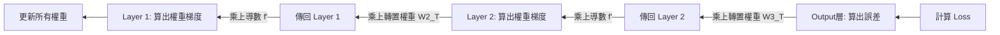

# 反向傳播 Backward Propagation 詳解：誤差的逆旅

這份文件拆解神經網路運作的第二階段，也是最核心的階段：**反向傳播**。

## 總結：什麼是反向傳播？

---

- **定義:**
    - 這是神經網路檢討或學習的過程。
    - 系統從 **輸出層 Output Layer** 計算出誤差，然後將這個誤差 **倒著 Reverse** 傳回給每一層神經元。
    - 目的只有一個：算出每個神經元對這個錯誤貢獻了多少，即梯度，以便進行修正。
- **白話比喻：刑案鑑識 Forensics**
    - **案發現場 Loss:** 發現最終結果錯了，例如：車子撞牆了。
    - **第一站 Output Layer:** 是誰最後控制方向盤？發現是方向盤打太右。
    - **第二站 Hidden Layer:** 是誰叫方向盤打右的？發現是視覺神經元看錯路。
    - **第三站 Input Weights:** 是誰讓視覺神經元看錯？發現是某個權重對陰影過度反應。
    - **結論:** 層層究責，開出罰單，梯度。

## 核心機制：單一神經元的檢討 SOP

---

在反向傳播中，每一個神經元要處理的任務比前向傳播複雜，它需要同時做 **自我檢討** 與 **推卸責任**。

- **第一步：接收指責 Receive Error Signal**
    - **動作:** 接收從 **下一層 Next Layer** 傳回來的誤差訊號 $\delta_{next}$。
    - **意義:** 知道自己送出去的訊號造成了後面多大的麻煩。
- **第二步：過濾 Derivative of Activation**
    - **動作:** 乘上 **激活函數的導數** $f'(z)$。
    - **意義:** 確認開關狀態。如果前向傳播時 ReLU 是關閉的 Output=0，那這個神經元當時根本沒參與，所以不需要負責，誤差 = 0。
- **第三步：自我檢討 Calculate Weight Gradient**
    - **動作:** $\text{Input} \times \text{Current Error}$。
    - **意義:** 算出自己的權重 $w$ 該怎麼改。這是我們更新模型的依據。
- **第四步：推卸責任 Pass Error Back**
    - **動作:** $\text{Current Error} \times \text{Weights}$。
    - **意義:** 算出有多少誤差是 **上一層 Previous Layer** 害的，準備傳給它們。

## 宏觀視角：誤差的接力賽

---

這是一個從終點跑回起點的接力賽。

- **輸出層 The Start of Backward**
    - 計算 **損失函數 Loss Function** 的導數。
    - 這是誤差誕生的源頭。
- **隱藏層 The Middlemen**
    - **Layer 3:** 收到 Output Layer 的責備，算出自己的梯度，並把剩下的責備傳給 Layer 2。
    - **Layer 2:** 收到 Layer 3 的責備，算出自己的梯度，傳給 Layer 1。
    - **特點:** 每一層都需要使用 **前向傳播時存下來的 Input 數據** 來計算梯度。
- **輸入層 The End**
    - 誤差傳到這裡通常就停止了，除非我們要對輸入圖片本身做修改，如 DeepDream。

## 開發者視角：轉置矩陣 Transposed Matrix

---

在程式碼與矩陣運算中，反向傳播有一個非常明顯的特徵：**形狀的翻轉**。

- **前向 vs 反向**
    - **前向:** $Z = X \cdot W$
    拿 Input 乘 Weight
    - **反向 求誤差:** $\delta_{prev} = \delta_{curr} \cdot W^T$
    拿 Error 乘 **Weight的轉置**
- **為什麼要轉置 $W^T$？**
    - **物理意義:** 在前向傳播時，我們把訊號發散給下一層；在反向傳播時，我們要從下一層把誤差收集回來。矩陣轉置正是對應這種反向收集的數學操作。

## 為什麼選擇反向傳播？ The Why

---

為什麼不隨機調整權重就好？為什麼要搞這麼複雜的微積分？

- **維度的詛咒 Curse of Dimensionality**
    - 現代模型有數億個參數。隨機調整就像買樂透，幾乎不可能中獎。
- **可微分性 Differentiability**
    - 神經網路的數學結構是 **光滑 Smooth** 的。
    - 反向傳播利用這個特性，直接計算出 **這一步往哪走誤差下降最快**，梯度。
    - 它不是猜測，它是 **精確導航**。

## 總結流程圖

---

