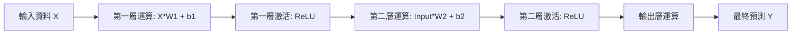

# 前向傳播 Forward Propagation 詳解：數據的旅程

這份文件旨在拆解神經網路運作的第一階段：**前向傳播**。

## 總結：什麼是前向傳播？

---

- **定義:**
    - 這是神經網路思考或推論的過程。
    - 數據從 **輸入層 Input Layer** 進入，經過一層層的數學運算加工，最後從 **輸出層 Output Layer** 吐出結果。
    - 這是一個 **單向 One-way** 的旅程，不走回頭路。
- **白話比喻：工廠流水線**
    - **原料 Input:** 一塊未經處理的鐵板。
    - **第一站 Layer 1:** 切割形狀，提取簡單特徵。
    - **第二站 Layer 2:** 焊接組裝，組合特徵。
    - **第三站 Layer 3:** 噴漆上色，高階加工。
    - **成品 Output:** 一台完整的汽車。

## 核心機制：單一神經元的加工 SOP

---

在前向傳播中，每一個神經元都是一個小小的加工站。它們只做四件事，順序永遠不變：

- **第一步：加權 Weighing**
    - **動作:** 看著輸入的訊號，乘以它的 **權重** $w$。
    - **意義:** 判斷這個訊號有多重要。
    - *例子*：如果這個神經元負責找車輪，那看到圓形的訊號權重就會很高。
- **第二步：加總 Summation**
    - **動作:** 把所有乘完權重的訊號加起來。
    - **意義:** 綜合評估所有線索。
- **第三步：偏差修正 Adding Bias**
    - **動作:** 加上一個數值 **偏差** $b$。
    - **意義:** 調整門檻。
    - *例子*：雖然總分只有 50 分，但如果 Bias 是 +10，總分就變成 60 分，及格。
- **第四步：激活 Activation**
    - **動作:** 通過 **激活函數 如 ReLU**。
    - **意義:** 決定是否放行。
    - *例子*：如果算出來是負數，ReLU 會把它變成 0，這個特徵不存在，不要傳給下一站。

## 宏觀視角：層與層的接力賽

---

當成千上萬個神經元排列成層時，前向傳播就變成了接力賽。

- **輸入層 The Starting Line**
    - 接收原始數據，例如：圖片的 RGB 數值。
    - 這一層不進行計算，只負責傳球。
- **隱藏層 The Runners**
    - **Layer 1:** 接收原始數據，找出簡單特徵，線條、顏色，傳給 Layer 2。
    - **Layer 2:** 接收簡單特徵，組合成複雜特徵，眼睛、輪胎，傳給 Layer 3。
    - **特點:** 每一層的輸出 Output，直接變成下一層的輸入 Input。
- **輸出層 The Finish Line**
    - 接收最後一層隱藏層的資訊。
    - 將這些高階特徵轉化為人類要的答案，例如：機率值 `[貓: 0.8, 狗: 0.1, 鳥: 0.1]`。

## 開發者視角：矩陣運算 Matrix Operations

---

在程式碼中，我們不會寫幾百萬個 `for` 迴圈去算每個神經元。我們使用 **線性代數** 來批次處理。

- **數據結構:**
    - **Input** $X$: 一個向量 Vector 或 矩陣 Matrix，如果是 Batch。
    - **Weights** $W$: 一個巨大的矩陣。
- **運算邏輯:**
    - 原本的 `sum(x * w) + b` 在程式中變成了：$$Z = X \cdot W + B$$
    - 這是一行程式碼就能解決的事情，例如 Python numpy 中的 `np.dot(X, W) + B`。
    - **GPU 的角色:** GPU 就是專門用來極速執行這種矩陣乘法的硬體。

## 訓練 vs 推論中的角色

---

前向傳播在 AI 的生命週期中無處不在，但目的不同。

- **在推論 Inference 時:**
    - **目的:** 給出答案。
    - **流程:** 只跑一次前向傳播。跑完就結束。
    - **資源:** 不需要記憶體去存中間值，跑完就丟。
- **在訓練 Training 時:**
    - **目的:** 為了後面的檢討，反向傳播做準備。
    - **流程:** 跑完前向傳播後，必須把每一層的計算結果 **存起來 Cache**。
    - **原因:** 因為等一下算梯度時，會問：剛剛第 3 層的輸入是什麼？這時候需要調閱剛剛存的緩存資料。
    - **資源:** 非常吃記憶體 VRAM。

## 總結流程圖

---

