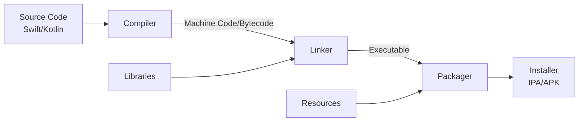
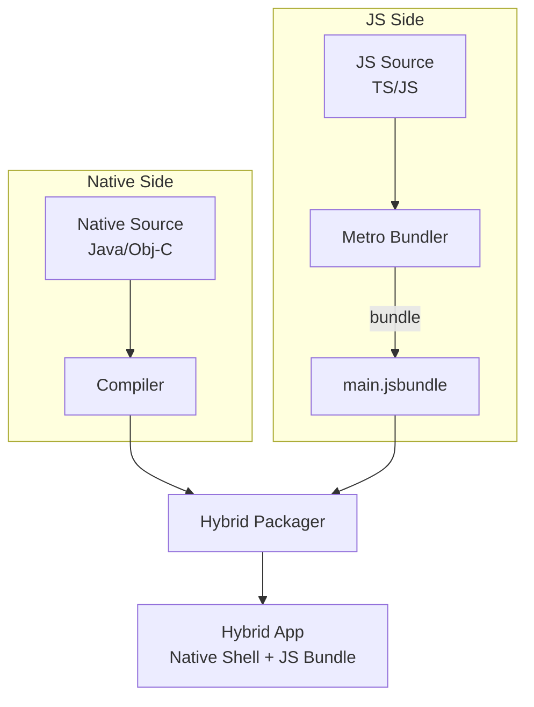
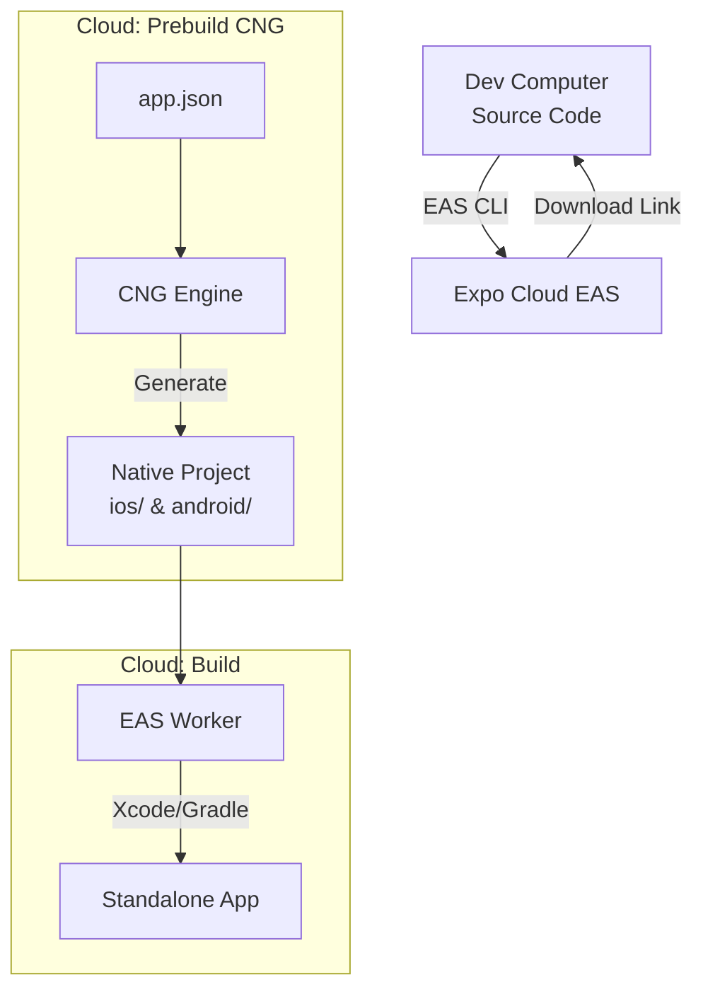

# App 開發演進史

本文將透過 **開發階段 Development Stage**、**開發運行 Development Runtime**、**打包建置 Build** 與 **正式運行 Production Runtime** 四個維度，講述 Mobile App 開發技術的演進故事。

---

## 原生開發 Native Development

故事的起點，是 iOS 與 Android 兩大陣營分治的時代。

### 開發階段 Development Stage

在這個階段，開發者必須為了兩個平台，組建兩支完全不同的軍隊。

- **iOS 陣營:**
  - **語言:** Swift 或 Objective-C
  - **核心環境:** 由 Xcode 處理
  - **套件管理:** CocoaPods / Swift Package Manager
  - **IDE:** Xcode
  - **作業系統:** 必須是 macOS
  - **建置工具:** Xcode Build System
- **Android 陣營:**
  - **語言:** Kotlin 或 Java
  - **核心環境:** JDK Java Development Kit
  - **套件管理:** Gradle
  - **IDE:** Android Studio
  - **作業系統:** Windows, macOS 或 Linux
  - **建置工具:** Gradle
- **特點:** 
  - **高牆:** 兩邊的程式碼完全無法共用。
  - **高成本:** 需要維護兩套程式碼、兩套工具鏈、兩個開發團隊。

### 開發運行 Development Runtime

在這個階段，運行等同於完整編譯後的執行。

- **情境:** 工程師在 Xcode 修改了一行 Swift 程式碼，按下了 Run。
- **流程:**
  - **重新編譯:** 電腦必須重新編譯修改過的檔案，並連結所有資源。
  - **重新安裝:** 將新的 App 安裝到模擬器或手機上。
  - **重啟 App:** App 必須完整重啟，狀態歸零。
- **特點:** 回饋循環 Feedback Loop 較長，修改介面後無法即時看到結果。

### 打包建置 Build

在這個階段，原始碼會被轉換成一個可安裝的壓縮檔。

#### 核心角色 Roles

- **編譯器 Compiler:**
  - **職責:** 翻譯官。
  - **行為:** 將人類寫的高階語言 Swift / Kotlin 翻譯成機器能執行的低階語言 機器碼 / Bytecode。
- **連結器 Linker:**
  - **職責:** 組裝工。
  - **行為:** 將編譯好的多個檔案，以及專案依賴的第三方函式庫，全部串接再一起，形成一個完整的執行檔。
- **打包工具 Packager:**
  - **職責:** 裝箱員。
  - **行為:** 將執行檔、圖片、設定檔等所有資源，封裝成一個符合作業系統規範的安裝包 ipa / apk。

#### 流程圖 Flowchart

#### 產物結構 Artifacts

- **iOS - IPA (.ipa):**
  - 本質是一個 zip 壓縮檔。
  - **Payload/**: 核心資料夾。
    - **MyApp.app**: 應用程式本體。
      - **Mach-O:** 編譯後的機器碼執行檔。
      - **Assets.car:** 圖片與圖示資源。
      - **Info.plist:** App 的身分證與設定檔。
      - **_CodeSignature:** 數位簽章，確保 App 未被竄改。
- **Android - APK (.apk):**
  - 本質也是一個 zip 壓縮檔。
  - **classes.dex:** 編譯後的 Bytecode，由 ART 虛擬機執行。
  - **AndroidManifest.xml:** App 的身分證與權限宣告。
  - **res/**: 圖片與排版資源。
  - **lib/**: 針對不同 CPU 架構 arm64 / x86 的原生函式庫。
  - **META-INF/:** 數位簽章資訊。

### 正式運行 Production Runtime

- **情境:** 使用者從 App Store 下載 App 並開啟。
- **機制:**
  - **iOS:** 作業系統直接執行二進位機器碼，直接呼叫 UIKit / SwiftUI 繪製畫面。
  - **Android:** ART Android Runtime 虛擬機執行 Bytecode，呼叫 Android SDK 繪製畫面。
- **優勢:** 沒有中間層，效能極致，完全取用系統能力。

---

## React Native 開發

Facebook 提出了解決方案，試圖用 JavaScript 來操控原生世界。

### 開發階段 Development Stage

React Native 引入了網頁開發的模式來開發 App。

- **統一語言:** 使用 JavaScript 或 TypeScript 來撰寫商業邏輯與畫面邏輯。
- **核心工具鏈:** Node.js, Yarn / npm。
- **編輯器:** VS Code。
- **特點:** 
  - **邏輯共用:** 絕大多數的商業邏輯可以在雙平台間共用。
  - **學習曲線:** 開發者只需熟悉 JavaScript 生態系。

### 開發運行 Development Runtime

React Native 引入了網頁開發的熱更新體驗。

- **情境:** 工程師在 VS Code 修改了 JS 檔案，按下存檔。
- **機制 Metro Bundler:**
  - 電腦端啟動一個 **Metro Server**，負責即時打包 JS 程式碼。
  - 手機端運行一個 **Debug App**，它連線到 Metro Server。
  - 當檔案變更，Metro 只傳送異動的 JS 片段 HMR，手機端 **JS 引擎** 接收後即時更新邏輯。
- **特點:** 畫面不需要重啟，狀態保留 Fast Refresh，開發體驗極快。

### 打包建置 Build

React Native 的 Build 變成了混合式的過程，產物結構也發生了變化。

#### 混合式結構 Hybrid Structure

最終的安裝包 ipa / apk 不再只是純粹的原生程式，而是包裹了 JS 引擎與 JS 程式碼的容器。

- **原生部分 Native Shell:**
  - **行為:** 依然由 Xcode / Gradle 編譯。
  - **內容:** 包含了 App 的啟動程式、React Native 的核心 C++ / Java / Obj-C 程式碼，以及少數的第三方原生套件。
- **JS 部分 JavaScript Bundle:**
  - **行為:** 由 Metro Bundler 打包。
  - **內容:** 所有的業務邏輯 JS 程式碼、React 框架程式碼，被合併成單一檔案。

#### 流程圖 Flowchart

#### 產物結構變化 Artifacts Change

- **iOS IPA 內新增:**
  - `main.jsbundle`: 這是 App 的靈魂，即編譯後的 JS 程式碼。
  - `assets/`: JS 程式碼中引用的圖片等資源。
- **Android APK 內新增:**
  - `assets/index.android.bundle`: 同樣是 JS 程式碼。
  - `files/` 或 `drawable/`: JS 依賴的靜態資源。

### 正式運行 Production Runtime

- **情境:** 使用者開啟 App。
- **機制 雙軌制:**
  - **原生殼層啟動:** 初始化 App，啟動內建的 JS 引擎 Hermes / JSC。
  - **載入 Bundle:** JS 引擎讀取內嵌的 `main.jsbundle`。
  - **Bridge 溝通:** JS 程式碼透過 Bridge 發送指令 JSON，指揮原生層繪製 UI UIView / Android View。
- **差異:** 相比開發 runtime，這裡沒有 Metro Server，沒有熱更新，執行的是優化過的離線 JS 檔。

---

## Expo 整合 當代主流

Expo 並非新技術，而是 React Native 的 **最佳實踐與託管平台**，它解決了 RN 建置過於複雜的問題。

### 開發階段 Development Stage

Expo 將開發體驗提升到了 **託管模式 Managed Workflow** 的層次。

- **工具鏈統一:**
  - 開發者不再需要接觸 Xcode 或 Android Studio。
  - 所有的開發操作都透過 **Expo CLI** 在終端機完成。
  - 核心環境變成了 **Node.js**。
- **設定與配置:**
  - 透過 `app.json` 或 `app.config.js` 統一管理雙平台的設定 權限、App Icon、Splash Screen。
- **特點:**
  - 只要會寫 JavaScript 就能開發 App，不需要懂 iOS / Android 的原生設定。

### 開發運行 Development Runtime - Expo Go

- **情境:** 開發者完全不需要安裝 Xcode / Android Studio。
- **機制:**
  - 手機安裝官方提供的 **Expo Go** App。這是一個萬能鑰匙，它已經預先安裝好了所有常用的 Native Modules。
  - 電腦端只需啟動 JS Server Metro。
  - Expo Go 掃描 QR Code 後，直接從電腦串流 JS Bundle 執行。
- **特點:** 就像寫網頁一樣，寫一行程式，手機立刻透過網路更新，完全跳過了原生編譯的痛苦。

### 打包建置 Build - EAS Build

Expo 將最讓開發者頭痛的本機環境建置搬到了雲端。

- **流程 Cloud Build:**
  - 開發者執行 `eas build`。
  - 程式碼上傳到 Expo 的雲端伺服器 EAS。
  - **EAS 伺服器 Linux / macOS:** 在雲端幫你執行完整的 `npm install` -> `Prebuild` 生成原生專案 -> `Xcode / Gradle Build`。
  - 最後直接回傳打包好的 `.ipa` / `.apk` 下載連結。
### 打包建置 Build - EAS Build

Expo 將最讓開發者頭痛的本機環境建置搬到了雲端，並引入了 **Prebuild** 預建置 的概念。

#### 核心角色 Roles

- **EAS CLI:**
  - **職責:** 指揮官。
  - **行為:** 讀取 `eas.json` 設定，將原始碼打包上傳至雲端，並監控建置進度。
- **Prebuild (CNG):**
  - **職責:** 建築師 (Continuous Native Generation)。
  - **行為:** 在雲端，根據 `app.json` 的設定，暫時性地「生成」出 iOS (`ios/`) 與 Android (`android/`) 的原生專案資料夾。這意味著你永遠不需要將這些龐大的原生檔案加入 git 版控。
- **EAS Build Worker:**
  - **職責:** 工人。
  - **行為:** 在雲端的 Mac / Linux 機器上，執行標準的 Xcode / Gradle 建置指令，產出最終安裝檔。

#### 流程圖 Flowchart

#### 產物結構 Artifacts - Standalone App

Expo 的最終產物也是標準的 IPA / APK，但其內涵與 Expo Go 不同。

- **精簡化殼層 Slim Shell:**
  - 不同於 Expo Go 包山包海，EAS Build 出來的 App **只包含**你專案真正有用到的 Native Modules。
  - 體積大幅縮小，啟動速度更快。
- **OTA 機制:**
  - 內建 `expo-updates` 模組，讓 App 具備在啟動時檢查並下載最新 JS Bundle 的能力，實現空中更新。

---

## 總結比較表

| 階段 | 開發階段 Dev Stage | 開發運行 Dev Runtime | 打包建置 Build | 正式運行 Prod Runtime |
| :--- | :--- | :--- | :--- | :--- |
| **Native** | **雙軌並行** 維護兩套 Code/IDE | **慢** 重編譯/重啟 | **本地** 依賴本機 OS 環境 | **原生核心** 機器碼直通 |
| **React Native** | **統一語言** JS/TS, VS Code | **快** Fast Refresh | **混合** 原生編譯 + JS 打包 | **雙軌制** JS 引擎 + Bridge |
| **Expo** | **託管模式** Expo CLI, Config | **極速** Expo Go 串流 | **雲端 EAS** 跨平台自動化 | **獨立 App** Standalone + OTA |
