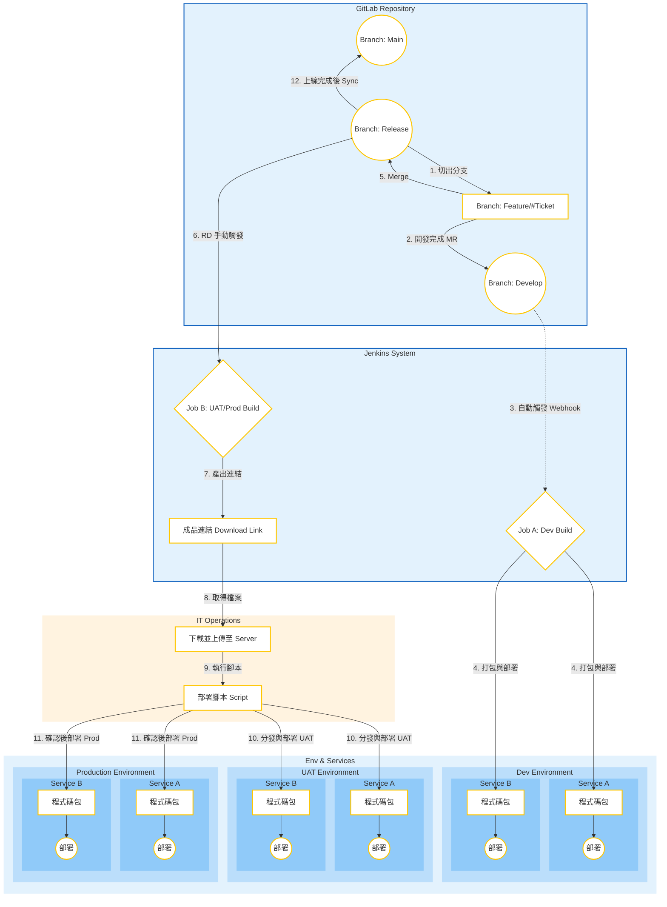
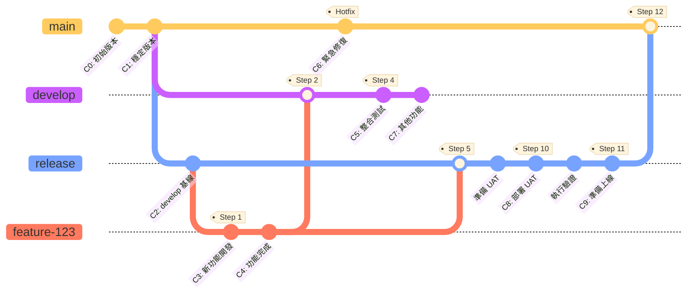

# RD 上板與分支管理流程標準書

## 流程圖

### CI/CD 與環境部署流程

以下圖表展示 Jenkins 自動化建置與部署流程:

### Git 分支與 Commit 時間序

以下圖表展示了從開發到上線的完整 Git 分支演進過程,包含 commit 時間序:

## 核心架構與定義

### 倉庫結構

- **管理工具:** GitLab
- **結構類型:** Monorepo 單一專案資料夾
- **子層級:** 包含多個 Service 資料夾,對應不同微服務或模組

---

## 分支策略

- **develop:** 開發主軸,所有新功能的匯集地。
- **release:** 預備發布區,用於 UAT 驗收與生產環境打包。
- **main:** 穩定主軸,僅存放已上線的穩定版本。
- **feature/#工單號:** 功能分支,源自 release。

---

## 自動化與工具

- **Jenkins Job A:** 自動觸發,負責打包並部署至 Dev 環境。
- **Jenkins Job B:** 手動觸發,負責將程式碼打包成單一檔案,並產出下載連結。
- **IT 操作:** IT 人員下載打包檔,上傳至伺服器,透過腳本進行分發與部署。

---

## 詳細作業流程

### 階段 - 開發與整合

- **起點:**
    - RD 接到新工單。
    - 從 `release` 分支切出新分支,命名為 `feature/#工單號`。
- **開發過程:**
    - RD 在 `feature` 分支進行程式碼撰寫。
    - 針對專案資料夾下的特定 Service 進行修改。
- **提交與合併:**
    - 開發完成,RD 發起 Merge Request,即 MR。
    - 目標分支指向 `develop`。
    - 進行 Code Review,若有此環節。
    - 合併進入 `develop` 分支。
- **自動化建置:**
    - `develop` 分支發生變動。
    - 觸發 GitLab Webhook。
    - 通知 **Jenkins Job A**。
    - Jenkins 辨識變動的 Service 資料夾。
    - 自動 Build 並部署至 **Dev Server**。

### 階段 - 驗收準備與打包

- **提測篩選:**
    - RD 確認 Dev 環境功能正常。
    - 選取 `develop` 分支中通過測試的 Commit。
    - 將這些 Commit 拉取,透過 Cherry-pick 或 Merge,至 `release` 分支。
- **手動建置與部署:**
    - RD 確認 Release 分支內容無誤。
    - **RD (研發人員)** 手動觸發 **Jenkins Job B**。
    - 指定 `release` 分支為來源。
    - Jenkins 執行打包作業,產出 **Artifact (程式碼包連結)**。
    - IT 人員下載 Artifact,上傳至 **UAT Server**。
    - IT 人員執行部署腳本 (Script)。
    - 腳本將程式碼包分發至對應 Service 資料夾,依照程式碼 build server。
    - 完成 **UAT 部署**。

### 階段 - 正式上線

- **驗收確認:**
    - QA/PM 完成 UAT 環境測試。
    - 確認版本無誤,準備上線。
- **正式部署:**
    - 使用 **階段二** 中,由同一份 Artifact。
    - IT 人員將該 Artifact 上傳至 **Production Server**。
    - **注意:** 確保 UAT 與 Production 使用同一份 Build,避免重新編譯導致差異。
    - IT 人員執行部署腳本,將程式碼分發並部署至 **Production Server**。

### 階段 - 同步歸檔

- **最終同步:**
    - Production 環境部署完成且運行穩定。
    - 將 `release` 分支的變更合併回 `main` 分支。
    - 標記 Tag,為選用項目,建議執行以利版號管理。