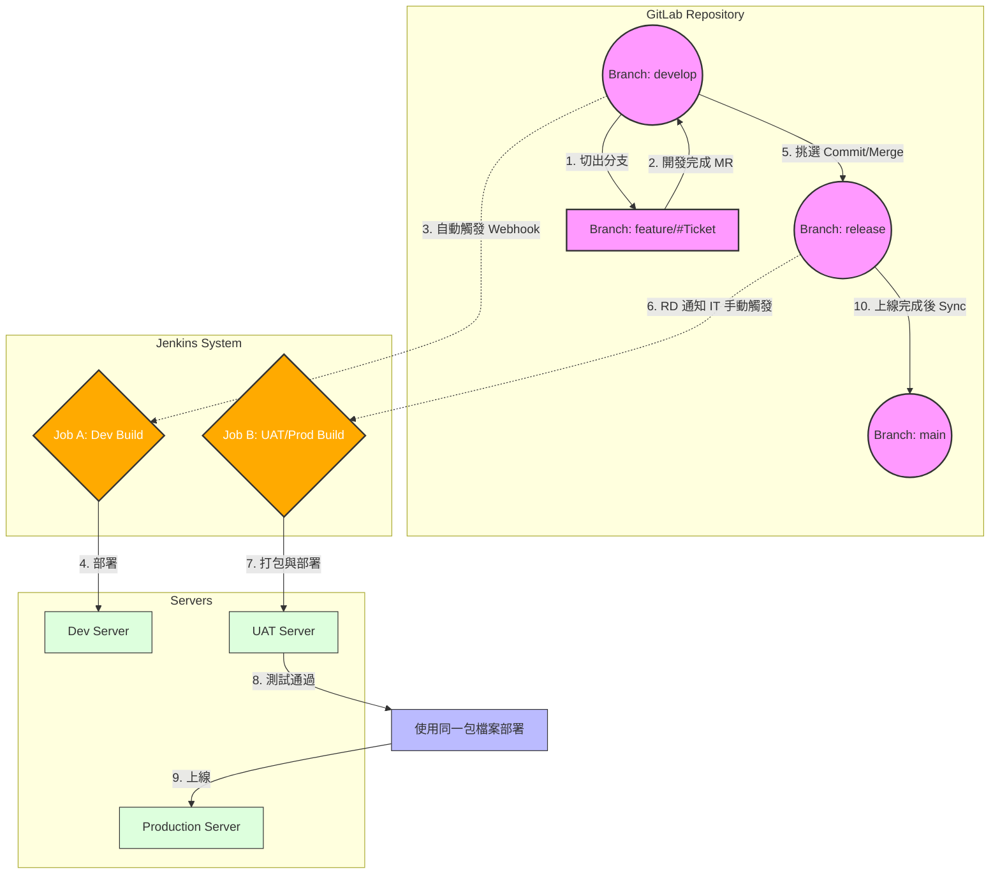

# RD 上板與分支管理流程標準書

## 總結：像濾網一樣的過濾機制

請將我們的程式碼流動想像成一個**多層過濾系統**。

- **Develop (開發池):** 這是最活躍的區域，所有的功能都在這裡匯集。就像混濁的水，雖然包含所有新元素，但可能還不穩定。這裡有自動化的幫浦 (Jenkins) 會隨時把水抽去測試 (Dev Server)。
- **Release (淨化池):** 當開發池中的某些水分子 (Commit) 被確認是乾淨的，我們手動將它們引流到這裡。這裡的水流變慢，由 IT 人員進行嚴格的水質檢測 (UAT)。
- **Main (純淨水庫):** 只有在淨化池經過完全驗證的水，最後才會被記錄到這個水庫中，代表這是絕對安全、已供給用戶使用的版本。
- **單一倉庫 (Monorepo):** 我們的倉庫像一個大櫃子，裡面有很多抽屜 (不同 Service)，每次整理時，我們只針對變動的抽屜進行打包。

## 核心架構與定義

### 倉庫結構 (Repository Structure)

- **管理工具:** GitLab
- **結構類型:** Monorepo (單一專案資料夾)
- **子層級:** 包含多個 Service 資料夾 (對應不同微服務或模組)

### 分支策略 (Branch Strategy)

- **develop:** 開發主軸，所有新功能的匯集地。
- **release:** 預備發布區，用於 UAT 驗收與生產環境打包。
- **main:** 穩定主軸，僅存放已上線的穩定版本。
- **feature/#工單號:** 功能分支，源自 develop。

### 自動化與工具 (CI/CD Tools)

- **Jenkins Job A (Dev Group):** 自動觸發，負責打包 Dev 環境。
- **Jenkins Job B (UAT/Prod Group):** 手動觸發，負責打包 UAT 與 Production 環境。

## 詳細作業流程

### 階段一：開發與整合 (Development Phase)

- **起點:**
    - RD 接到新工單。
    - 從 `develop` 分支切出新分支，命名為 `feature/#工單號`。
- **開發過程:**
    - RD 在 `feature` 分支進行程式碼撰寫。
    - 針對專案資料夾下的特定 Service 進行修改。
- **提交與合併:**
    - 開發完成，RD 發起 Merge Request (MR)。
    - 目標分支指向 `develop`。
    - 進行 Code Review (若有此環節)。
    - 合併進入 `develop` 分支。
- **自動化建置 (Dev Env):**
    - `develop` 分支發生變動。
    - 觸發 GitLab Webhook。
    - 通知 **Jenkins Job A**。
    - Jenkins 辨識變動的 Service 資料夾。
    - 自動 Build 並部署至 **Dev Server**。

### 階段二：驗收準備與打包 (UAT Phase)

- **提測篩選:**
    - RD 確認 Dev 環境功能正常。
    - 選取 `develop` 分支中通過測試的 Commit。
    - 將這些 Commit 拉取 (Cherry-pick/Merge) 至 `release` 分支。
- **手動建置 (UAT Env):**
    - RD 通知 IT 人員或相關負責人。
    - **無**自動化通知機制。
    - 操作人員手動觸發 **Jenkins Job B**。
    - 指定 `release` 分支為來源。
    - Jenkins 執行打包作業，將檔案部署至 **UAT Server**。

### 階段三：正式上線 (Production Phase)

- **驗收確認:**
    - QA/PM 完成 UAT 環境測試。
    - 確認版本無誤，準備上線。
- **正式部署:**
    - 使用 **階段二** 中，由 `release` 分支產出的相同打包檔案 (Artifacts)。
    - **注意:** 確保 UAT 與 Production 使用同一份 Build，避免重新編譯導致差異。
    - 部署至 **Production Server**。

### 階段四：同步歸檔 (Sync Phase)

- **最終同步:**
    - Production 環境部署完成且運行穩定。
    - 將 `release` 分支的變更合併回 `main` 分支。
    - 標記 Tag (選用，建議執行以利版號管理)。

## 流程圖 (Workflow Diagram)

