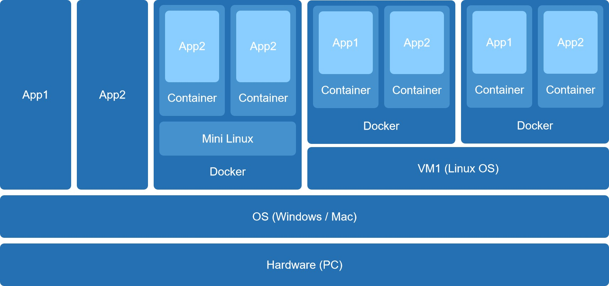
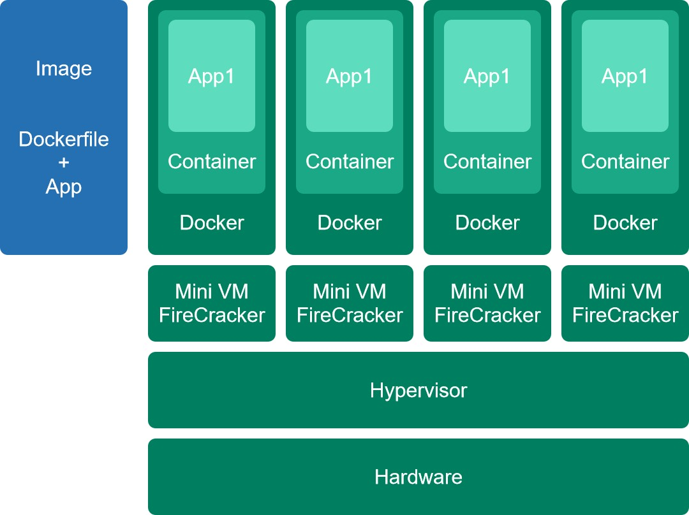

# 現代雲端架構演進總結

## 從個人電腦到雲端: IaaS vs. PaaS

在軟體開發中,我們不僅要寫程式,還要想辦法讓程式跑起來。這五張圖,正是一部應用程式如何跑起來的演進史,核心是責任分界線的轉移。

我們使用兩種顏色來定義誰負責管理:

- **藍色 Self-Managed:** 開發者或公司必須自己負責安裝、設定、維護、更新。
- **綠色 AWS-Managed:** 雲端服務商 AWS 會自動幫你管理好一切。

---

## 一切的起點 - 本地開發

這張圖是所有開發者的起點: 在自己的個人電腦 PC 上工作。

- **顏色分析 - 全藍色:** 非常貼切。從實體硬體 PC、作業系統 Windows/Mac,到安裝 Docker 或 VM,再到應用程式 App1, App2,所有的一切都需要開發者自己負責。
- **架構分析:** 這張圖也展示了在本地端運作的多種方式:
    - **App1/App2 左側:** 直接跑在 OS 上,這是最傳統的方式,不同 App 之間可能會有環境衝突。
    - **Docker 中間:** 使用 Docker Desktop。它在背景偷偷跑了一個 `Mini Linux VM`,來實現 Container 隔離。
    - **VM1 右側:** 開發者自己手動建立一台完整的 VM,然後在 VM 裡安裝 Docker。這就像在電腦裡蓋了一間空房子。

**結論:** 這是最靈活的階段,但也是最繁瑣、最難以規模化的。

---

## 邁向雲端 - IaaS 基礎設施

當本地電腦不夠用時,第一步就是上雲,租用 IaaS 基礎設施即服務,代表服務是 AWS EC2。

- **顏色分析 - 綠藍分明:** 這是最關鍵的責任分界線。
    - **綠色 AWS 管理:** AWS 負責管理實體的 `Hardware` 硬體、`Hypervisor` 虛擬化技術。它們提供了一台空的 VM EC2,就像提供一間空房子。
    - **藍色 自我管理:** 開發者必須自己登入這台 EC2 空房子,自己負責內部裝潢: 安裝 OS 更新、安裝 `Docker`、部署 `Container` 和 `App`、設定防火牆等。
- **架構分析:** 這就是雲端上最常見的 VM 加容器模式。

**結論:** 開發者擺脫了管理實體硬體的麻煩,但仍然需要自己管理作業系統和應用程式。

---

## 專注本業 - PaaS 資料庫

管理資料庫 DB 是一件非常複雜的事,包括備份、擴展、主從同步 Master-Slave。於是,開發者決定把這件髒活外包出去,採用 PaaS 平台即服務,代表服務是 AWS RDS。

- **顏色分析 - 全綠色:** 完美! `Hardware`、`Hypervisor`、`VM`、`DB App RDS` 全部都是綠色 AWS 管理。
- **責任分析:** AWS 提供的是精裝修且附帶管家的服務。開發者無法也不需要登入底層的 VM 或 OS。
- **架構分析:** 這張圖描繪了 RDS 服務的內部運作: 它是由多台 VM 組成,一台 `Master DB` 負責寫入,多台 `Slave DB` 負責讀取,並由 AWS 自動管理它們之間的 `SYNC` 同步。
- **開發者的工作 - 藍色:** 只有一件事 - 把資料 Data,圖中 `Master DB` 藍色內核,存進去和讀出來。

**結論:** 開發者把管理資料庫的繁瑣工作外包給 AWS,自己只管使用它。

---

## 終極進化 - PaaS 應用程式

開發者連管理 EC2 IaaS 來跑 App 都覺得累了,例如要自己處理 Auto Scaling,於是決定把 App 也改成平台即服務 PaaS,代表服務就是 AWS Fargate。

- **顏色分析 - 關鍵分界:**
    - **藍色 開發者責任:** `Image Dockerfile + App`。開發者唯一的責任就是寫好 App,並把它打包成一個標準化的藍圖 Image。
    - **綠色 AWS 責任:** 所有正在運行的實例 Task!
- **架構分析:** AWS Fargate 拿走藍色的藍圖,然後自動幫你完成所有綠色的工作:
    - 啟動 `Hardware` + `Hypervisor`。
    - 啟動 `Mini VM Firecracker` 來提供 VM 等級的安全隔離。
    - 在 VM 裡啟動 `Docker` + `Container` + `App1`。
    - 最重要的是,它會自動水平擴展 Scale-Out,也就是圖中複製好幾份一模一樣的綠色運行實例。

**結論:** 開發者把管理應用程式伺服器的工作也外包給 AWS,自己只管提供程式碼 Image。

---

## 組裝完整架構

最後,這張圖試圖將所有服務組合成一個完整的、可擴展的應用程式架構。

### 組件說明

- `Outside Service` 外部請求
- `Loading Balance` 負載平衡器或交通警察
- `Container` Fargate 跑的 App 工人
- `Master DB / Slave DB` RDS 提供的資料庫

### 流程說明

- 請求 `Outside Service` 進入 `Load Balancer` PaaS。
- `Load Balancer` 盲目地把請求分發給 Fargate `Container1` 或 `Container2` PaaS。
- **聰明才智**必須寫在 `App1` 藍色 Image 的程式碼裡。
- `Container` 收到請求,`App1` 程式碼自己判斷:
    - 這是一個 `Write` 寫入請求! → 於是它連線到 `RDS Master Endpoint` PaaS。
    - 這是一個 `Read` 讀取請求! → 於是它連線到 `RDS Slave Endpoint` PaaS。
- `RDS` PaaS 在內部自動處理 `Master → SYNC → Slave`。

---

## 總結

這一趟旅程,就是從什麼都自己管的本地開發全藍色,演進到只管程式碼 Image 和資料的全雲端 PaaS 架構全綠色的過程。

---
