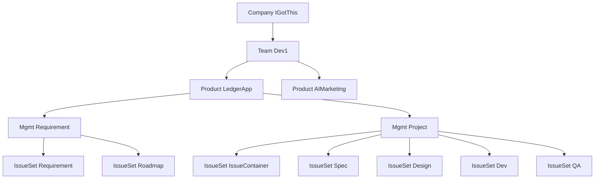
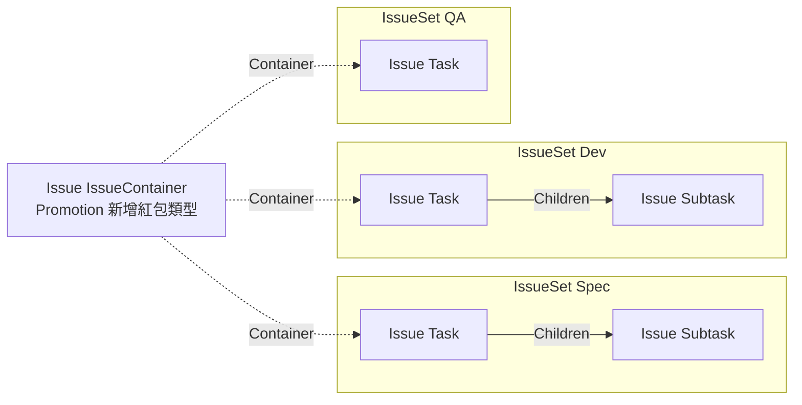
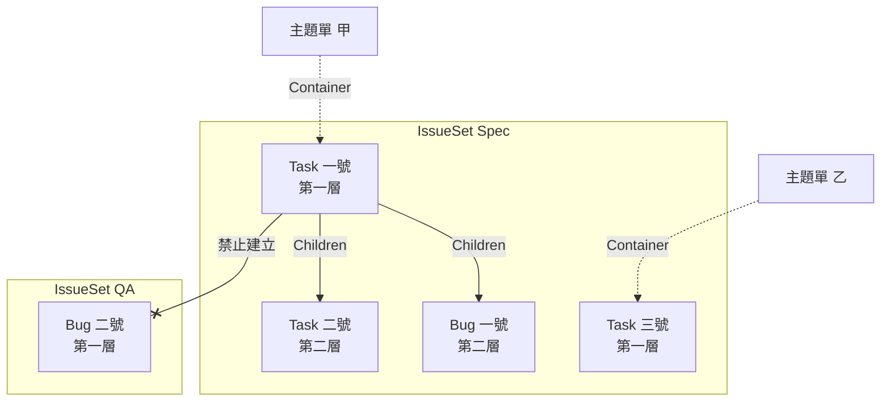
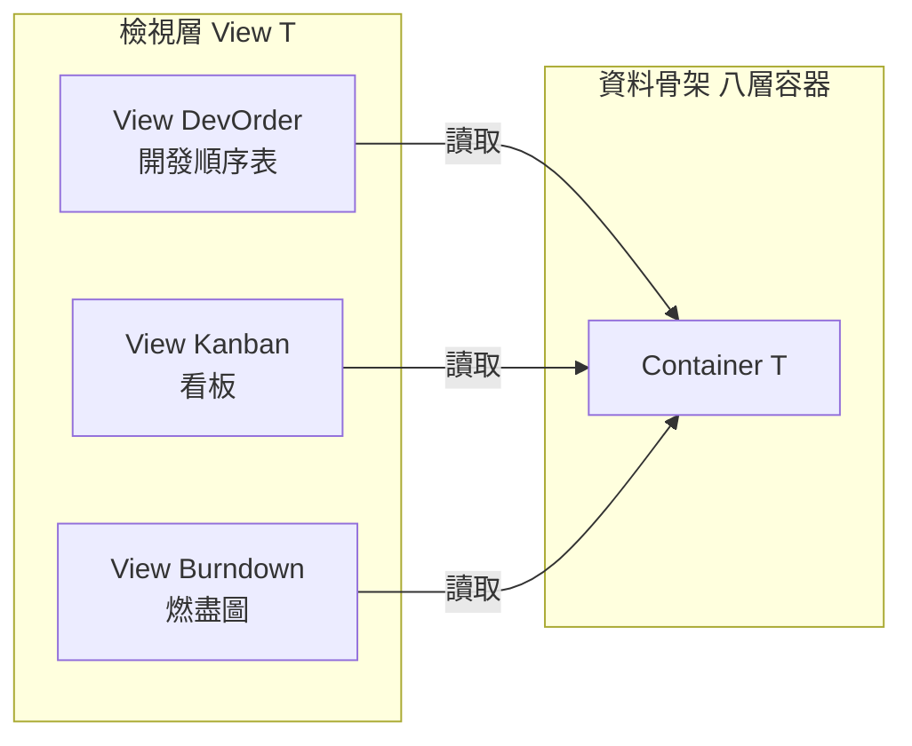

# 工單資料模型定案紀錄

> 本篇記錄 IGotThis 工單資料模型的定案，含容器骨架、關聯機制、檢視層與欄位總表。內容由系統結構圖逐題推導而來，每項定案附選擇理由。範圍外依賴的處理狀態收在末段。

## 本篇範圍

- **涵蓋:**
    - 容器骨架與泛型代數
    - 工單之間的關聯機制與儲存形態
    - 檢視層的定位與排序歸屬
    - 欄位總表與強制範圍建議
- **不涵蓋:**
    - 權限模型與分享的細部規則
    - 版控整合的自動化深度
    - 成本計算與工作日設定
    - 報表與資料匯出
- **推導前提:** 泛型參數由使用者自訂，系統只出骨架

---

## 容器骨架

- 八層容器同構，每層只裝下一層
- 每層形狀皆為 `Container<T>`，`T` 是語意標籤非資料型別
- **結構為嚴格樹狀，不允許多重歸屬:**
    - 一個 `Product` 只屬一個 `Team`
    - 理由是彙總正確性，多重歸屬會讓上層統計重複計算同一份成本
    - 跨團隊要看同一個產品，由權限解決，不由結構解決

```
Company<T>
└── Team<T>
    └── Product<T>
        └── Mgmt<T>
            └── IssueSet<T>
                └── Issue<T>
                    └── FieldSet<T>
                        └── Field<T>
                            ├── FieldTitle
                            ├── FieldValueType
                            └── FieldValue
```

- 實例化後的樣貌以單一團隊為例



- `Mgmt<Requirement>` 收需求端，回答想做什麼
- `Mgmt<Project>` 收執行端，回答怎麼做出來
- 兩者的分界即產品管理與專案管理的職責邊界
- Company 底下並非只有實例樹，共三個支柱

```
Company
├── 實例樹 ────→ Team 以下八層容器，裝實際的工單與欄位值
├── 定義區 ────→ 型別配方與關聯規則，全公司共用一份
└── 檢視層 ────→ View<T>，讀實例樹，存檢視自身的狀態
```

- 實例樹回答現在有哪些工單
- 定義區回答工單長什麼形狀
- 檢視層回答怎麼看這些工單
- **系統寫死的部分:**
    - 八層容器與包含順序
    - `Field` 的三欄形狀，為標題、值型別、值
    - 值型別的原語清單
- **使用者自訂的部分:**
    - 每個 `T` 的名稱與語意
    - 欄位組的欄位配方
    - 工單型別採用哪些欄位組
    - 工單集收哪些工單型別

---

## 兩個正交的關聯軸

- **縱軸為母子:**
    - `Issue<Task>` 持有 `Issue<Subtask>`
    - 只發生在同一個 `IssueSet` 內
    - 深度不設上限，層數由使用者疊出
- **橫軸為主題:**
    - `Issue<IssueContainer>` 綁定各工單集的同主題工單
    - 一定跨 `IssueSet`
    - 主題單本身不承載工作內容，只是把手
- 主題單解掉的是排序打架 → 排序掛主題而非掛工單 → 各工單集共用同一份順序
- 主題單與被綁工單平輩 → 被綁工單不離開原工單集
- 兩軸交會的樣貌以主題紅包類型為例，設計不參與故不開單



- 實線為母子，方向朝下，只在同一個工單集內
- 虛線為主題綁定，方向朝橫，一定跨工單集
- 兩軸正交，互不取代

---

## 綁定方向定案

- 關聯只存持有端，單向
- 主題單持有成員清單，成員不持有回指欄位
- 反查由系統維護索引，索引是衍生資料可重建
- **選擇理由:**
    - 寫入路徑只有一條 → 不會出現半邊更新
    - 反查慢屬效能問題 → 由索引解決，不由資料模型承擔

---

## 主題綁定的基數定案

- 一張工單只能被一個主題單綁，主題綁定為獨佔
- 一個主題單在同一個 `IssueSet` 內可綁多張工單
- **選擇理由:**
    - 彙總正確性是本設計的核心價值
    - 允許一單多主題 → 工時與完成率重複計算 → 數字失真且不易察覺
    - 開發順序表會出現同一張工單佔兩個位置，完成歸屬無法判定
- **共用工作的處理方式:**
    - 兩個主題都需要的前置工作，拆成獨立主題單
    - 兩個主題以前後關聯等待該主題單完成
    - 此寫法的語意比硬掛兩個主題更準確
- **例外的出口:**
    - 真需要非獨佔的連結時，新增一筆關聯型別定義即可
    - 現階段不預先開放

---

## 母子承載定案

- 母子關係走 `Field` 機制，不另開系統內建父子
- `Issue<Task>` 的配方追加 `FieldSet<Children>`
- 子單不加父單參照欄位，與綁定方向定案同一條規則
- **選擇理由:**
    - 主題綁定已證明工單持有工單可用 `Field` 表達
    - 另開內建機制等於在全開放設計中挖特例 → 特例會擴散

---

## 參照型別定案

- 參照原語只有一種，為工單參照
- 關聯之間的差異全部移到關聯型別定義表
- **定義表持有五個開關，每種關聯一列:**
    - 獨佔，被指端只能被一個持有端指到
    - 禁環，寫入前檢查可達性
    - 有序，是否使用排序值
    - 對稱，無方向且查詢時雙向合併
    - 彙總，子單的值是否往上累計
- 新增第五種關聯時填一列即可，不必改程式
- **既有關聯的開關組合:**

| 關聯型別 | 獨佔 | 禁環 | 有序 | 對稱 | 彙總 |
|---|---|---|---|---|---|
| Children | 是 | 是 | 是 | 否 | 是 |
| Container | 是 | 是 | 否 | 否 | 是 |
| Before | 否 | 是 | 否 | 否 | 否 |
| RelatedTo | 否 | 否 | 否 | 是 | 否 |

- **選擇理由:**
    - 母子的子型別不固定 → 不能靠工單型別區分關聯
    - 關聯種類會持續增加 → 寫死原語會擋住第三種
- **使用者可自建關聯型別:**
    - 新增一列並自行設定五個開關即可
    - 內建的四種標系統欄，不可刪除
- **組合檢查兩條，寫入定義時執行:**
    - 對稱為真 → 獨佔與有序必為假。無方向即無持有端，唯一與排序皆無基準
    - 彙總為真 → 獨佔與禁環必為真。否則會重複計算或無限遞迴
- 危險組合由檢查擋，不由權限擋 → 權限只擋人，擋不住組合本身

---

## 關聯的儲存形態

- 純值欄位進值表，參照欄位進邊表
- 分開的理由為參照需要反查、索引、唯一約束與環偵測
- 純值欄位不需要以上任何一項
- `Field` 在模型上是一種東西，落到儲存拆成兩條路

```
Field<T>
├── 單值與多筆 ──→ issue_field_value
│                   Title、Status、StartTime、Comment
└── 關聯       ──→ issue_relation
                    Children、Container、Before、RelatedTo
```

```sql
CREATE TABLE issue_field_value (
  issue_id   uuid,
  field_type text,
  value      jsonb,
  PRIMARY KEY (issue_id, field_type)
);

CREATE TABLE issue_relation (
  from_id   uuid,
  to_id     uuid,
  rel_type  text,
  ordinal   int  DEFAULT 0,
  exclusive boolean,
  PRIMARY KEY (from_id, rel_type, to_id)
);

CREATE INDEX ON issue_relation (from_id, rel_type, ordinal);
CREATE INDEX ON issue_relation (to_id, rel_type);
CREATE UNIQUE INDEX ON issue_relation (to_id, rel_type) WHERE exclusive;
```

- 獨佔開關複製到每一列，讓部分唯一索引可靜態建立
- 關聯型別由使用者自訂 → 唯一約束無法寫死 schema → 靠該欄補
- **前後關係只存單一方向:**
    - 後續方向由反查索引取得
    - 雙向都存會在改動時失去同步
- 對稱關聯同樣只存一列，查詢時合併兩個方向
- 禁環檢查在寫入時執行，事後補救成本極高

---

## 母子邊界定案

- 母子鏈不得跨 `IssueSet`
- 跨工單集的連結只有主題綁定一條路
- **層級的計算方式:**
    - 主題單是錨點，不佔層
    - 層級從工單集內無父工單起算
    - 層級由結構決定，不由工單型別決定
- **範例:**
    - `IssueSet<Spec>` 同時收 `Issue<Task>` 與 `Issue<Bug>`
    - 主題單甲持有 Task 一號，Task 一號持有 Task 二號與 Bug 一號
    - Task 一號為第一層，Task 二號與 Bug 一號為第二層
    - `IssueSet<QA>` 的 Bug 不得與 `IssueSet<Spec>` 的工單建立母子



- 實線為母子，虛線為主題綁定，交叉線為禁止建立的關聯
- 層級由結構位置決定，工單型別不影響層級
- Bug 一號落在第二層，因為持有端是 Task 一號
- 同一種 Bug 掛到主題單底下即為第一層
- **選擇理由:**
    - 主題綁定已是專責的跨工單集機制 → 母子再跨等於兩套機制搶同一件事
    - 層級切換要有確定語意 → 同一層必須是同一種東西

---

## 檢視層定案

- 檢視層是骨架之外的第二根柱子，與容器代數平行
- 形狀為 `View<T>`，實例含開發順序表、看板、燃盡圖
- **檢視層共用的骨架:**
    - 識別碼、名稱、擁有者
    - 資料來源，即拉進來的 `Mgmt<T>` 清單
    - 篩選條件
    - 顯示層級
    - 手動排序
    - 分享對象與權限
- 檢視層與資料骨架的關係為單向讀取



- 檢視層只讀資料骨架，排序等檢視自身的狀態存在檢視層
- **資料來源的選取與儲存:**
    - 儲存的形態一律是 `Mgmt` 清單
    - 選取介面支援勾 `Team` 或 `Product`，勾選當下即展開成 `Mgmt` 清單
    - 展開後不再跟隨來源，日後新增的 `Mgmt` 不自動進表
- **選擇理由:**
    - 逐個勾選的成本隨公司規模惡化，六十個 `Mgmt` 難以維護
    - 存 `Team` 或 `Product` 會讓表的內容自行擴張
    - 自行擴張與新單先進未排序區的定案衝突，該定案要求新工單經人決策才入表
    - 納入新 `Mgmt` 應是一次明確的勾選動作
- **開發順序表的組成:**
    - 首欄為主題單清單，可拖拉改順序
    - 次欄為甘特圖，可切換顯示層級
    - 資料來源跨 `Product`，用途是團隊人力分配

```
┌──────────────┬────────────────────────────────────┐
│ 已排序       │ 甘特圖      顯示層級 第一層        │
├──────────────┼────────────────────────────────────┤
│ 主題單 甲    │ ████████                           │
│ 主題單 乙    │      ██████████                    │
│ 主題單 丙    │              ██████                │
├──────────────┼────────────────────────────────────┤
│ 未排序 三張  │ 拖入已排序區才取得位置             │
│ 主題單 丁    │                                    │
│ 主題單 戊    │                                    │
│ 主題單 己    │                                    │
└──────────────┴────────────────────────────────────┘
```

- 主題單必要存在 → `Mgmt<T>` 一律內建 `IssueSet<IssueContainer>`

---

## 主題單位置的組成與替換

- 建立 `Mgmt<T>` 時由使用者把 `IssueSet` 拉進來
- 介面自動帶入一個系統內建的 `IssueSet<IssueContainer>`
- 該位置不可移除，但可被符合條件的 `IssueSet` 替換
- **內建位置的組成:**
    - `IssueSet<IssueContainer>` 只收一種工單型別
    - 該型別為 `Issue<IssueContainer>`
    - 其配方含必帶欄位組與 `Field<Container>`
- **替換的條件，兩條皆須滿足:**
    - 替換用的 `IssueSet<T>` 只收一種工單型別
    - 該工單型別的配方含 `Field<Container>`
- 不滿足條件的 `IssueSet` 不出現在替換選單
- **選擇理由:**
    - 約束放在型別組成，不放在替換動作
    - 壞掉的組合組不出來 → 操作時不需攔截，也不需警告視窗
    - 限收單一型別是為了讓開發順序表首欄語意單一
- 此處是不限制工單型別定案的唯一例外，理由為系統內建功能直接依賴

---

## 排序歸屬定案

- 排序值存在檢視層，工單不持有排序欄位
- 一個帳號可建立多張表
- 建立者決定分享對象
- 共識靠分享達成，不靠資料約束
- **換來的代價:**
    - 無法回答某主題全域排第幾
    - 只能回答某主題在某張表排第幾
    - 跨表統計優先序的功能做不出來

---

## 新單入表定案

- 表分已排序區與未排序區
- 新建主題單先進未排序區，拖入後才算排入
- 被篩選條件排除的工單保留排序值
- 未排序區的數量顯示在畫面，作為該排序的訊號
- **選擇理由:**
    - 排序的本質是決策 → 未經決策的工單不該被指派位置
    - 自動排首或排尾都是系統代做的假決定

---

## 顯示層級切換定案

- 切換顯示層級時，主題單清單恆定不變
- 該層級無內容的主題單顯示為空列
- 空列的資訊是該主題尚未拆到該層深度
- 首欄穩定 → 拖拉排序的操作對象不隨層級變動
- 沿用母子邊界定案的範例，兩種層級的畫面差異如下

```
顯示第一層
┌───────────┬──────────────────────────┐
│ 主題單 甲 │ Task 一號                │
│ 主題單 乙 │ Task 三號                │
└───────────┴──────────────────────────┘

顯示第二層
┌───────────┬──────────────────────────┐
│ 主題單 甲 │ Task 二號   Bug 一號     │
│ 主題單 乙 │ 空列 尚未拆到第二層      │
└───────────┴──────────────────────────┘
```

---

## 欄位形狀定案

- 欄位分單值與多筆兩種形狀
- **單值欄位:**
    - 值格放一個值
    - 稽核欄位屬單值欄位加唯讀旗標
- **多筆欄位:**
    - 值為一串記錄，每筆自帶作者與時間
    - 每筆需可單獨定位，支援引用、編輯、刪除
    - 儲存需獨立資料表，不可折進 jsonb
    - 承載留言、附件、工時記錄
    - 可見範圍等同所屬工單，不另設每筆的權限
- 不另設權限的理由是整體權限模型尚未設計，單獨開特例會與日後的模型衝突

---

## 彙總模式定案

- 可彙總的欄位帶一個模式開關，值為自動或手動
- 自動模式的值由子單算出，欄位轉唯讀
- 手動模式的值由人填寫，子單不覆蓋
- 葉節點沒有子單，恆等同手動
- **模式的初值規則:**
    - 欄位已有值 → 手動
    - 欄位為空 → 自動
    - 使用者隨時可切換
    - 由手動切回自動時原值捨棄，不做確認
- **手動模式仍在背後計算彙總值:**
    - 彙總值不作為主值顯示
    - 兩值只要有差距即標示偏離，不設門檻
    - 偏離的實際天數直接顯示，由使用者自行判斷嚴重程度
    - 缺這一層，子單超期在母單完全看不出來
- 不設門檻的理由是差幾天算嚴重因團隊而異，給數字比替團隊訂線準確

```
Task#2   手動  3/1 - 3/20
                    偏離警示 子單彙總為 3/1 - 4/15，超出二十六天
  Task#3 自動  3/1 - 4/15
```

- **可彙總的欄位共四個，其餘皆否:**
    - 起始日，取子單最早
    - 結束日，取子單最晚
    - 估點，取子單加總
    - 工時，恆為自動，工時由執行者填報，母單手填無意義
- 狀態、負責人、標題不彙總
- 欄位可否彙總在欄位定義上宣告，不由使用者逐張工單決定
- **選擇理由:**
    - 一組欄位同時承載計畫與實際 → 開子單後語意漂移 → 模式開關讓意圖顯性
    - 拆成計畫與實際兩組欄位也能解，但葉節點要重複填兩次日期
- **基準線由欄位變更歷史承擔:**
    - 主值欄位只保留當下的值，不保留歷次舊值
    - 起訖日列入變更歷史的追蹤範圍
    - 某工單延了幾次、滑了幾天，由變更歷史回答

---

## 欄位來源定案

- 系統原生功能依賴的欄位一律內建
- 內建欄位不可刪除，不可停用
- 泛型參數不支援命名空間，欄位組名稱維持單一名詞
- 檢視層不設欄位覆寫層，直接讀內建欄位
- **換來的代價:**
    - 第二組日期語意需要時，須改系統而非改設定
- **顯示名稱與識別名稱分離:**
    - 顯示名稱可改，供團隊用語使用
    - 識別名稱不可改，程式依此尋找欄位
    - 顯示名稱只有一份，跟隨 Company 設定的語言
    - 不隨帳號語言切換，多語言屬商品化階段的工作

---

## 欄位定義的儲存

```sql
CREATE TABLE field_set_def (
  name   text PRIMARY KEY,
  system boolean
);

CREATE TABLE field_def (
  name       text PRIMARY KEY,
  field_set  text,
  kind       text,
  value_type text,
  system     boolean,
  readonly   boolean,
  rollupable boolean,
  rollup_fn  text,
  tracked    boolean,
  label      text
);
```

- 刪除或停用時檢查系統欄，為真即擋
- `rollup_fn` 記彙總的算法，值為最早、最晚、加總三者之一
- `tracked` 標該欄位的異動是否寫進變更歷史
- **兩個概念須分開:**
    - 系統欄指欄位定義不可從系統移除
    - 工單型別帶哪些欄位組，由型別定義決定

---

## 型別定義的歸屬定案

- 型別定義全部收在 Company 底下的定義區
- 定義區與 Team 平行，不屬任何 Product
- 全公司共用同一份定義
- **定義區收的內容:**
    - 欄位定義與欄位組定義
    - 關聯型別定義與其旗標
    - 工單型別的欄位組配方
    - 工單集型別可收哪些工單型別
- **選擇理由:**
    - 定義一致 → 同一個型別在各產品意思相同 → 跨產品報表可比
    - 各產品自帶定義會讓跨產品統計失效，代價付得太早
- **換來的代價:**
    - 單一產品要客製型別時，動到的是全公司的定義
    - 產品之間的需求衝突無處緩衝
- **後續升級路徑:**
    - 衝突真的出現時，改為定義在 Company、產品可加不可改
    - 該升級須處理繼承與覆寫規則，實作成本較高

---

## 強制範圍定案

- 內建欄位分必帶與可選兩類
- 必帶欄位每種工單型別都有，配方不可取消
- 可選欄位在建立工單型別時預設勾選，可自行取消
- **必帶的判準:**
    - 缺了工單無法被辨識或被引用
    - 缺了系統原生功能會壞掉
    - 缺了究責與稽核無從進行
- **選擇理由:**
    - 全部強制會讓需求單出現估點欄位 → 使用者不知該不該填 → 開始無視所有欄位
    - 預設勾選加可取消 → 漏勾風險低 → 兼顧一致與精簡
- **可選欄位缺席時的處理:**
    - 檢視層遇到缺欄位的工單，排除並顯示原因
    - 甘特圖不畫沒有起訖日的長條
    - 工單有無排程欄位本身即資訊，等同宣告該型別是否進排程

---

## 工單編號定案

- 編號格式為前綴加流水號，例如 `LSPEC-142`
- 前綴取自該工單所屬 `IssueSet` 的 KEY
- **KEY 的取得:**
    - 建立 `IssueSet` 實例時由使用者自行指定
    - 全公司唯一，撞號時擋下並要求改
    - 系統依產品名與 `IssueSet` 名產生建議值，使用者可改
- **KEY 的字元限制:**
    - 長度二到八字元
    - 僅接受大寫英文與數字
    - 不可由數字開頭，理由是與流水號區隔
- **流水號的規則:**
    - 在該 `IssueSet` 內遞增，不跨 `IssueSet`
    - 編號產生後永不改，工單移至其他 `IssueSet` 仍保留原號
    - 刪除的號不回收
- **選擇理由:**
    - 編號的價值在不必點開即知出處
    - `IssueSet` 是階段，階段是最常需要辨識的維度
    - 只帶產品前綴會讓同產品各階段的票混在同一串號
- **不重新編號的代價:**
    - 移動後的編號可能與現況不符
    - 重新編號會讓所有既有連結失效，代價更大
    - 工單另外顯示目前所屬的 `IssueSet`

---

## 工單型別不設限定案

- `IssueSet` 不宣告允許收哪些工單型別
- 任何工單型別皆可開進任何 `IssueSet`
- **選擇理由:**
    - 系統只出骨架，語意約束由使用者自理
    - `IssueSet` 收什麼型別會隨團隊演化，白名單會變成阻力
- **換來的代價:**
    - 開錯位置沒有機制擋，語意維持靠團隊紀律
    - 日後若補白名單，既有錯放資料須先清理
- **緩解方式:**
    - 建單介面依該 `IssueSet` 的既有工單，把常用型別排前
    - 此為引導，非限制
- 唯一例外是主題單位置，理由見主題單位置的組成與替換

---

## 狀態流程定案

- Status 不是單純的選項欄位，走完整的狀態流程
- 流程定義綁工單型別，一種工單型別一套
- 流程定義收在 Company 定義區
- **流程定義的內容:**
    - 狀態清單
    - 允許的轉換，以來源狀態與目標狀態成對
    - 轉換條件，含執行者角色與必填欄位
    - 起始狀態與終止狀態
- **建立工單型別時帶入最小流程:**
    - 三個狀態，為待處理、處理中、已關閉
    - 已關閉為終止狀態，轉入時必填結案原因
    - 最小結案原因清單為已完成與不做
    - 全部可改可刪可加
- **附最小流程的理由:**
    - 空白流程會卡死第一次使用，連第一張票都開不出來
    - 多套樣板看似貼心，但初次建立型別時無從判斷該選哪套
    - 三個狀態幾乎所有工作皆適用，需細分再自行追加
- **綁工單型別的理由:**
    - 流程差異來自工作性質不同，不是來自所在的工單集
    - 缺陷單要重現確認、任務單不用，此差異與工單集無關
    - 工單集由使用者自訂且數量會長，綁工單集會讓流程定義失控
    - 同型別需要不同流程時，訊號是該拆成兩種型別

---

## 結案原因與狀態分離

- Status 回答工單走到哪一格
- Resolution 回答工單的下場是什麼
- 兩者必須分開，不可用 Status 一欄承擔
- **不分開時的狀態清單:**

```
待處理 ──→ 處理中 ──┬──→ 已完成
                     ├──→ 不修了
                     ├──→ 重複單
                     ├──→ 無法重現
                     └──→ 非缺陷
```

- **分開後的狀態清單:**

```
待處理 ──→ 處理中 ──→ 已關閉
                        └─ 關閉時必填 Resolution
                           已修復 / 不修了 / 重複單 / 無法重現 / 非缺陷
```

- **分開換到的四件事:**
    - 流程圖維持單一主線，維護得動
    - 看板依 Status 分欄，欄數不隨結束理由增加
    - 完成率以已關閉為分母、已修復為分子，一次查詢算完
    - 新增結束理由不必回頭改報表
- 同一個 Status 可對應不同下場 → 已關閉既可能是修復也可能是放棄
- 用 Status 表達此差異需拆成兩個狀態，用 Resolution 表達只需兩個值
- **選項清單隨工單型別各一份，與狀態流程同一層:**
    - 缺陷單的選項為已修復、無法重現、非缺陷、重複單
    - 需求單的選項為已納入、不做、延後評估
    - 兩者交集極小，共用一份會讓選單塞滿不相關的選項
- **選擇理由:**
    - 結案原因是流程終點的配套，與流程綁同一層最一致
    - 全公司一份會汙染選單 → 選錯機率上升 → 完成率失真
    - 基底加追加的兩層結構，會讓使用者每次都要判斷選項該放哪層
- 重複建置由複製解 → 建立新工單型別時可複製既有型別的流程與選項

---

## 欄位變更歷史

- 更新時間與更新者只記最後一次，會把歷史蓋掉
- 形狀為多筆欄位，每筆存欄位名、舊值、新值、執行者、時間
- 系統寫入，使用者不可直接編輯
- **記錄範圍由欄位定義宣告:**
    - 欄位定義加一個追蹤開關
    - 開關為真的欄位，每次異動寫一列
    - 狀態、估點、起訖日、負責人預設開啟
    - 說明與留言不追蹤，留言本身已是多筆欄位
- **消費此資料的功能:**
    - 燃盡圖，重建任一日的剩餘工作量
    - 週期時間與卡關分析，取狀態停留時長
    - 基準線追蹤，回答某工單延了幾次、滑了幾天
- **不採每日快照的理由:**
    - 快照綁死當時的篩選條件，改條件後無法重算
    - 資料量隨天數乘檢視層數成長
    - 變更歷史為單一來源，任何時點皆可重建
- **不採當前值回推的理由:**
    - 估點事後調整會改寫過去的曲線
    - 曲線每週不同且查不出原因，燃盡圖失去可信度
- **保留期限不設上限，不自動封存:**
    - 追溯是本系統的核心價值，砍歷史等同砍價值
    - 資料量成為問題時再訂封存策略，屆時已有實際數字可依據

---

## 值型別原語清單

| 原語 | 用途 | 範例欄位 |
|---|---|---|
| 文字 | 短字串 | Title、BranchName |
| 長文 | 支援 markdown 與截圖 | Description |
| 數字 | 整數與小數 | StoryPoint |
| 日期 | 無時間部分 | StartTime、EndTime |
| 時間戳 | 含時分秒 | CreateTime、UpdateTime |
| 選項 | 固定選項集合 | Status、Resolution、Severity |
| 使用者 | 指向帳號 | Assignee、CreateBy |
| 布林 | 是與否 | ExternalTool |
| 工單參照 | 指向其他工單 | Children、Container |
| 檔案 | 附件本體 | Attachment |

- 值型別是使用者唯一不可擴充的清單
- 使用者可組配方，不可發明新原語

---

## 欄位總表

- 強制範圍分三級
    - **必帶:** 每種工單型別都有，配方不可取消
    - **可選:** 建立工單型別時預設勾選，可取消
    - **純自訂:** 使用者自行建立
- 必帶欄位共十四個，橫跨基本欄位組與關聯欄位組

### 基本欄位組

| 欄位 | 形狀 | 值型別 | 強制範圍 | 寫入者 | 用途 |
|---|---|---|---|---|---|
| IssueKey | 單值 | 文字 | 必帶 | 系統 | 唯一識別，前綴取自所屬工單集的 KEY |
| Title | 單值 | 文字 | 必帶 | 使用者 | 工單辨識 |
| Description | 單值 | 長文 | 必帶 | 使用者 | 改動說明 |
| Status | 單值 | 選項 | 必帶 | 使用者 | 流程狀態，看板依賴 |
| Resolution | 單值 | 選項 | 必帶 | 使用者 | 結案原因，完成率依賴 |
| Assignee | 單值 | 使用者 | 必帶 | 使用者 | 負責人，撞期篩選依賴 |
| Comment | 多筆 | 長文 | 必帶 | 使用者 | 討論記錄 |
| ChangeLog | 多筆 | 文字 | 必帶 | 系統 | 欄位變更歷史，燃盡圖與基準線依賴 |
| Archived | 單值 | 布林 | 必帶 | 系統 | 軟刪除旗標 |
| CreateTime | 單值 | 時間戳 | 必帶 | 系統 | 稽核 |
| CreateBy | 單值 | 使用者 | 必帶 | 系統 | 稽核 |
| UpdateTime | 單值 | 時間戳 | 必帶 | 系統 | 稽核 |
| UpdateBy | 單值 | 使用者 | 必帶 | 系統 | 稽核 |
| Attachment | 多筆 | 檔案 | 可選 | 使用者 | 佐證素材 |

- `IssueKey` 與 `Title` 分開，因標題可改而識別碼不可改
- `IssueKey` 要能寫進 commit 訊息、貼進聊天室、被全文搜尋
- `ChangeLog` 每筆記欄位名、舊值、新值、執行者、時間
- `Archived` 取代硬刪除，理由是他單的關聯欄位可能正指著本單

### 關聯欄位組

| 欄位 | 形狀 | 值型別 | 強制範圍 | 寫入者 | 用途 |
|---|---|---|---|---|---|
| Children | 關聯 | 工單參照 | 必帶 | 使用者 | 母子，顯示層級切換依賴 |
| Container | 關聯 | 工單參照 | 主題單專屬 | 使用者 | 主題綁定，順序表首欄依賴 |
| Before | 關聯 | 工單參照 | 可選 | 使用者 | 排程依賴，甘特圖連線 |
| RelatedTo | 關聯 | 工單參照 | 可選 | 使用者 | 無方向的相關連結 |

- `Container` 只進主題單型別的配方，一般工單型別不帶
- 後續方向的欄位不獨立存在，由反查取得

### 專案欄位組

| 欄位 | 形狀 | 值型別 | 強制範圍 | 寫入者 | 用途 |
|---|---|---|---|---|---|
| StartTime | 單值 | 日期 | 可選 | 使用者 | 甘特圖起點 |
| EndTime | 單值 | 日期 | 可選 | 使用者 | 甘特圖終點 |
| StoryPoint | 單值 | 數字 | 可選 | 使用者 | 估點 |
| WorkLog | 多筆 | 數字 | 可選 | 使用者 | 工時填報，成本表依賴 |
| ExternalTool | 單值 | 布林 | 可選 | 使用者 | 標記外部工具產出，不計工時 |

### 版控欄位組

| 欄位 | 形狀 | 值型別 | 強制範圍 | 寫入者 | 用途 |
|---|---|---|---|---|---|
| BranchName | 單值 | 文字 | 可選 | 使用者 | 對應 branch |
| CommitNo | 單值 | 文字 | 可選 | 使用者 | 指向 commit |

### 品質欄位組

| 欄位 | 形狀 | 值型別 | 強制範圍 | 寫入者 | 用途 |
|---|---|---|---|---|---|
| Severity | 單值 | 選項 | 可選 | 使用者 | 缺陷嚴重度 |
| TestCase | 多筆 | 長文 | 可選 | 使用者 | 功能測試案例 |

### 純自訂欄位範例

| 欄位 | 形狀 | 值型別 | 用途 |
|---|---|---|---|
| 類型 | 單值 | 選項 | 區分 feature 與 bug |
| 前後台 | 單值 | 選項 | 分類維度 |
| 前後端 | 單值 | 選項 | 分類維度 |
| DueDate | 單值 | 日期 | 對外承諾日 |

### 明確不是欄位的項目

- **Priority:** 存在檢視層，工單不持有
- **Layer:** 由母子結構算出，非儲存值
- **版控 repo 位置:** 屬工單系統的設定項，非工單資料

---

## 定案對範圍外工作的依賴

- 本篇範圍內的項目皆已定案
- 部分定案以本篇範圍外的工作為前提，三項依賴皆已另篇處理
- **權限模型已定案:**
    - 跨團隊檢視同一產品由權限解決，權限的範圍清單可單獨指向一個 `Product`
    - 多筆欄位不另設權限，可見範圍等同所屬工單，此結論維持
    - 權限粒度下限為 `Mgmt`，單張工單不另設權限
- **工作日與假日已定案:**
    - 偏離天數扣除假日，單位為工作天
    - 甘特圖橫軸維持日曆天，假日格以灰底標示
    - 日曆定義收在 Company 定義區，由帳號與檢視層各自選用
- **檢視層形態已盤點完畢:**
    - 其餘形態的欄位依賴檢查未帶出新的必帶欄位
    - 必帶欄位維持十四個，本篇欄位總表不因盤點修改
    - 檢視層共用骨架追加欄位顯示設定與工作日曆選用兩項
