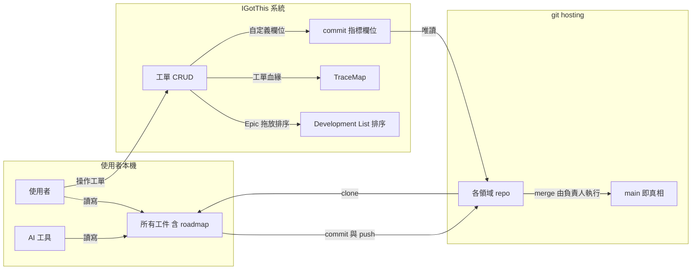

# IGotThis 系統總覽

> 本篇回答 IGotThis 是什麼、解決什麼痛點、工作發生在哪裡。本篇是整個資料夾的入口，不需先讀其他主題。構想大綱來源為 PM 的 mindmap 盤點與後續口述補充。

## 定位

- IGotThis 是自建管理系統的構想
- 一句話定位：外連 GitHub 或 GitLab，是疊在 git hosting 之上的管理層
- requirement、roadmap、spec、design、dev、qa 六域各自有一組工單系統
- 工件存放位置由所有權檔位決定，六域分屬兩種檔位
- 工件留在使用者的 git，系統只持有 commit 指標
- 六域以 Container 為單位成套，公司有幾個 Container 就開幾套
- 容器層級見組織與泛型結構篇，檔位推導見所有權檔位篇
- 目標：產品開發的全部工件關聯進同一套資料模型，追溯不再靠人腦
- 定性：框架產出物的索引層，加上框架下游的執行層
- 索引而非儲存：工件的內容不進系統，系統持有的是關聯
- 不承載框架各層的判斷過程本身
- 發展路徑：先內部自用驗證，跑順後商品化
- 在 Product Management 決策框架中的位置：
  - 決策框架的流程終點停在規格開發
  - IGotThis 承載框架中上游的產出物，如 Product Map 層級與需求池
  - 同時把框架未覆蓋的下游納入：排程、成本、開發追蹤、品質

---

## 三個定調決策

- 整套構想有三條定調決策，各篇推導皆以此為前提
- 工件不進系統：所有工件留在使用者 git，系統只持有 commit 指標
- 系統的寫入範圍：系統只寫工單，工件一律唯讀
  - 唯讀原則的明定例外是關聯資料匯出，往 repo 寫一份關聯資料檔，見功能構想篇
- 不含 AI：AI 協作全部發生在使用者本機
  - 系統不接任何模型 API
  - 細則見系統邊界與市場對照篇

---

## 協作模式全景圖

- 全景圖回答的問題：工作發生在哪裡、三個場域各自分工什麼
- 三個場域各為一區：使用者本機、IGotThis 系統、git hosting

- 工件的 CRUD 全在本機發生，不在 IGotThis 裡發生
- IGotThis 能處理的 CRUD 是工單的 CRUD
- AI 工具的施工與讀取全在使用者本機，由使用者自理
- 系統對 hosting 只讀 commit 指標，工件內容不進系統
  - 唯一寫入例外是關聯資料匯出，見三個定調決策
- Development List 與 TraceMap 皆消費工單資料，一句話定義見名詞速查表
- 工單與 branch 綁定、commit 追蹤的自動化屬構想中，深度之後再議

---

## 現況與痛點

### 工具現況

- Priority List：個別 excel 檔維護
- Spec：按 feature 拆分，工具無版本控制
- Design：Figma
- Scope：Redmine 與 JIRA
- Timeline：以工期表達，個別 excel 檔維護，人工同步回 Priority List

### 痛點清單

- bug 發生時追不到原始 spec → 只能請 RD 翻 code 或問資深成員
- 施工時長無法管理 RD 績效，偷懶難以辨識
- 施工時長被灌水
- excel 之間人工同步 → 必然漏
- 沒有甘特圖
- branch 與 commit 對不到工單

### 根因歸納

- 真相分散：spec、priority、timeline、design 各自活在不同工具
- 工具之間無結構性鏈結 → 追溯靠人腦 → 人一走知識就斷

---

## 名詞速查表

- 各名詞先給一句話定義，完整推導見對應主題

| 名詞 | 一句話定義 | 詳見主題 |
|---|---|---|
| 工件 | 被版本管理的內容本體，如規格文件、mockup code、程式碼 | 所有權檔位篇的領域屬性矩陣 |
| 工單 | ticket，Requirement、Epic、Task 皆是工單 | 資料模型與追溯篇 |
| 所有權檔位 | 系統的第一級軸，回答工件歸誰管、由誰編輯 | 所有權檔位篇 |
| Container | 六域成套的單位，內含 Product 集合與 Project 集合 | 組織與泛型結構篇 |
| Management | 一個領域一套工單系統，可掛一個使用者 repo | 組織與泛型結構篇 |
| 錨點 | ref 型別欄位的一種用法，Epic 以此錨定 roadmap commit | 組織與泛型結構篇的欄位與篩選章節 |
| Epic | scope 跨領域的工作容器 | 資料模型與追溯篇 |
| Task | 綁單一領域的勞動單位，母單與子單同型 | 資料模型與追溯篇 |
| TraceMap | 每類工單強制連到上一層形成的追溯鏈 | 資料模型與追溯篇 |
| Development List | 多個 Epic 拖放排 priority 的清單 | 功能構想篇 |
| WishList | 需求收單池，一列一張 Requirement 單 | 資料模型與追溯篇 |

---

## 閱讀地圖

- 其餘七篇建議依此排列順序閱讀
- 所有權檔位篇：工件歸誰管這個開關如何推導整套系統，是其餘各篇的前提
- 組織與泛型結構篇：系統由哪些容器組成，泛型如何收斂自定義
- 資料模型與追溯篇：工單如何對應 branch，追溯鏈如何成形
- 端到端流程篇：一條需求從開單到上線的完整旅程
- 功能構想篇：系統提供哪些功能，各自解掉哪個痛點
- 系統邊界與市場對照篇：系統刻意不做什麼，與 git hosting 和市面工具如何分工，含真差異化與 build vs buy 判斷
- 風險與待決篇：設計風險、依決策框架的自我檢核、所有待決事項
