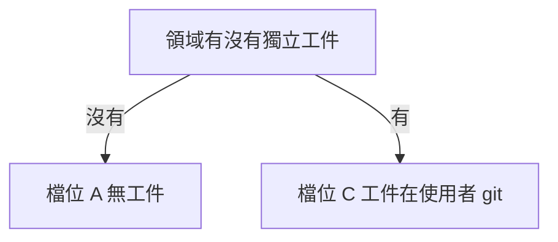

# 所有權檔位

> 本篇回答工件歸誰管這一個開關如何推導整套系統，檔位只有兩檔。所有權檔位是讀懂其餘各篇的前提。建議先讀系統總覽篇，掌握系統定位與痛點。

## 檔位是什麼

- 所有權檔位是整套系統的第一級軸，基底只有這一個開關
- 開關問的是：工件的資料歸誰、由誰編輯
- 檔位只有 A 與 C 兩檔
- 工件一律不在系統內，系統不提供工件編輯器
- 其餘屬性皆由此開關推導，不是各領域自填
- 推導出的屬性：有無階層、匯出粒度、merge 的有無與執行者
- merge 的時機是領域約定，不由檔位推導

---

## 檔位判定圖

- 這張圖回答：一個領域該落在哪個檔位
- 判定只有一問：領域有無獨立工件

- 判定結果選型時一次選定，代價見換檔的代價章節

---

## 檔位 A 無工件

- 真相與異動塌成同一物件，沒有第二個物件可版控
- 加的那一列就是異動本身
- 此檔位無 repo 掛勾
- 修改歷史由資料庫的稽核記錄承載，可做到欄位級
- 可攜性以匯出功能補
- 追溯鏈不受影響，上游單引用一個 id 即可
- 業界佐證：JIRA、Linear、Redmine 的工單皆存資料庫

---

## 檔位 C 工件在使用者 git

- 格式由外部生態定義，編輯留在本機，系統唯讀
- Management 掛一個使用者 repo，工單以 commit 指標欄位指向該 repo
- 改動內容寫在工單的 description
- 系統不解析 git 內的檔案內容，不做結構切分
- 階層不成立，工件內部分幾層是使用者自己的約定
- 追溯精度到 commit，不到條目
- roadmap 亦屬此檔，工件是 roadmap 文件
  - PM 在本機編輯，決策時在 git merge 定案

---

## 不成立的組合

- 不成立的組合：外部生態格式配無工件
- 沒有第二個物件，就沒有外部格式，也沒有外部編輯者

---

## 推導屬性總表

- 這張表回答：選定檔位後，各屬性如何跟著定案

| 屬性 | 檔位 A | 檔位 C |
|---|---|---|
| 工件位置 | 無工件，異動列即真相 | 使用者 git |
| repo 掛勾 | 無 | 掛一個使用者 repo |
| 編輯者 | 系統獨佔寫入 | 使用者本機，系統唯讀 |
| 階層 | 不成立 | 不成立，分層是使用者約定 |
| merge 時機與執行者 | 無 merge 事件，寫入即生效 | 人在 git 執行，時機是領域約定 |
| git 語意 | 無 git | 真相所在 |
| 追溯精度 | 資料列，稽核可到欄位級 | commit，不到條目 |
| 匯出粒度 | 資料列，以匯出功能補可攜性 | 只給 repo 路徑與 commit |

- 有 git、誰能編輯、階層皆由檔位推導，領域屬性矩陣不逐項列出
- 有無階層：兩檔皆不成立
  - 分層屬掛勾 repo 內的資料，系統管不到，故矩陣不列
- 誰能編輯：檔位 A 系統獨佔寫入，檔位 C 留本機
- 有無 git：只有檔位 C 有，git 是真相所在
- merge 時機是領域約定，不由檔位推導
  - 檔位 C 的 merge 一律由人在 git 執行，系統只觀測
  - roadmap 約定決策時 merge，spec、design、dev、qa 約定上線時 merge
  - 檔位 A 無 merge 事件，寫入即生效

---

## 領域屬性矩陣

- 六個領域是兩種檔位的六次實例化，差異收在同一張表

| 領域 | 檔位 | 工件是什麼 | 系統看得到什麼 |
|---|---|---|---|
| requirement | A | 無獨立工件 | 完整資料列 |
| roadmap | C | roadmap 文件 | repo 與 commit |
| spec | C | 規格文件 | repo 與 commit |
| design | C | mockup code | repo 與 commit |
| dev | C | 程式碼 | repo 與 commit |
| qa | C | 回歸測試流程 | repo 與 commit |

- 各欄的判準：
  - 檔位：工件的資料歸誰、由誰編輯，判準見檔位是什麼章節
  - 工件是什麼：實際被版控的東西
    - 必須能 diff，這是 Figma 檔被排除的理由
  - 系統看得到什麼：可供報表、篩選、追溯消費的粒度
    - 檔位 C 只到 commit，內容不解析

---

## 換檔的代價

- 檔位是重構級決策，不是設定開關
- 換檔要寫 importer、搬遷真相所在、要使用者換工具
- 選型時一次選定，不規劃分期升檔
