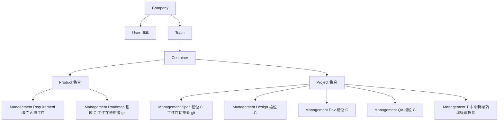
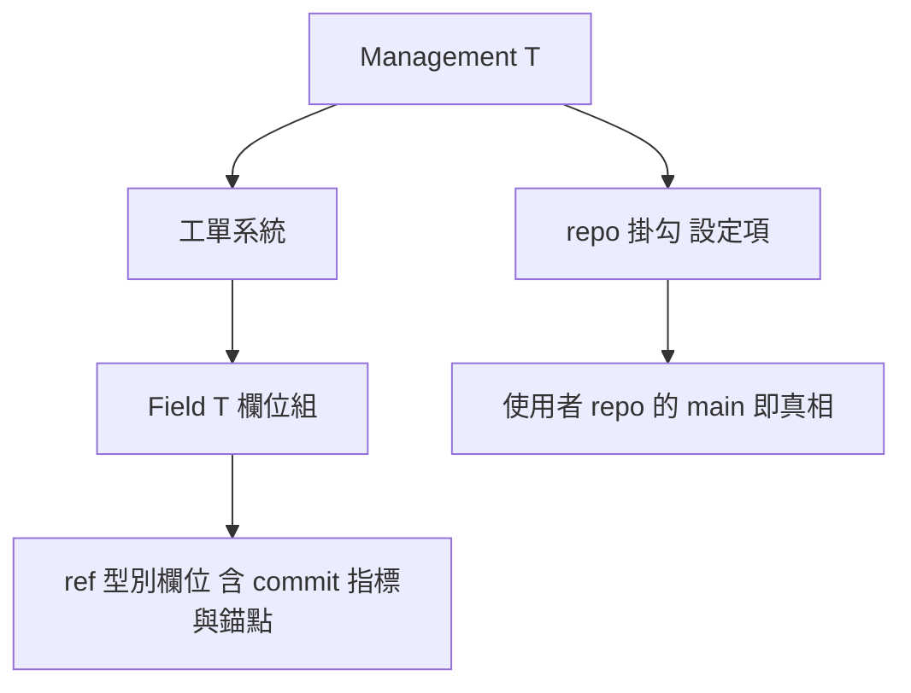

# 組織與泛型結構

> 本篇回答系統由哪些容器組成、泛型如何收斂自定義。建議先讀所有權檔位篇。

## 容器階層

- 本節收錄整套系統的容器層級
- 泛型不是比喻，是組織骨架
- 檔位 A 與檔位 C 的定義見所有權檔位篇
- 容器階層圖回答 Company 到各 Management 的包含關係

- Company 是計費單位，按不重複人數收費
- User 屬於 Company，可跨 Team 與 Container
- Container 不帶型別參數，固定一組配對
- Product 集合是封閉集合，恰好兩個 Management
- Project 集合是開放集合，可擴充
- 未來新增領域從 `Management<T>` 這一槽長出

---

## Company 層第一階段範圍

- 第一階段不做 Company 建立流程
  - 內部自用只有一個 Company，手動建立
  - 不做自助註冊、不做多 Company、不做網域驗證
- 計費規則已定：按 Company 內不重複人數
  - 此處計費指 IGotThis 向客戶收費，與成本計算表的工時彙總無關
  - 一人跨幾個 Container 都只算一次
  - 跨 Container 是刻意設計，計費不懲罰跨用行為
  - 實務細節可採週期內最高人數計費，期中加人按比例
  - 理由：防止在扣款日前先移除帳號
- 延後的代價：User 對 Company 是一對一還是多對多屬 schema 決策
  - 商品化補做時，這層關係要重構而非加功能

---

## 補做時的參考模型

- Atlassian 的組織模型可直接沿用，補做時不需重查
- 帳號獨立於組織
  - 個人帳號以 email 註冊，先於任何組織存在
  - 一個帳號可加入多個組織
- 網域驗證接管帳號
  - 組織證明擁有某 email 網域後，該網域帳號變成受管帳號
  - 受管後才能強制單一登入、停用、刪除
  - 沒有這層，員工離職會把帳號帶走
- 多層管理角色取代單一擁有者
  - 組織管理員最高，管使用者、群組、產品存取、網域、安全政策
  - 往下有站台管理員與產品管理員
  - 組織管理員可多人，單點風險自然消失
- 計費按不重複使用者計算，跨站台不重複收費
- 不建議沿用的部分：站台這一層
  - 站台層是網址命名空間演變來的歷史包袱
  - 多數公司只用一個站台，也是使用者公認的困惑來源
  - Team 到 Container 的結構已足夠，不需對應層

---

## Management 的定義

- `Management<T>` 是一個領域的工單系統
- 工單系統恆存在，形狀固定，一律歸資料庫
- 檔位 C 的 Management 掛一個使用者 repo
  - 掛勾是 Management 的設定項，不是資料
- 真相本體在掛勾 repo 的 main，系統不持有真相、只持有指向
- 指向由 ref 型別欄位承載，見欄位與篩選章節
- 六個 Management 中，帶 repo 掛勾的有五個
- Management 結構圖回答單一 Management 內部由什麼組成

- repo 掛勾的有無由檔位決定，判準見所有權檔位篇

---

## Product 集合封閉、Project 集合開放

- 劃分是決策側與執行側
  - Product 集合收決策側的 requirement 與 roadmap
  - Project 集合收執行側的 spec、design、dev、qa 四域
- 此劃分是否定案、或兩集合合併，尚待拍板
  - 詳見風險與待決篇
- Product 集合恰好兩個 Management，型別參數寫死
- Project 集合可有 N 個 Management，型別參數開放
- 新增領域只能長在 Project 集合側
  - 加 `Management<Security>` 成立
  - 加在 Product 集合側不成立
- Container 內 Product 集合與 Project 集合一對一，兩者皆必要
  - 純技術債專案也要開對應的 Product 單
  - 理由：每筆施工都要溯得到需求，是整套追溯的前提

---

## 泛型帶來什麼

- 六個領域是同一個 `Management<T>` 的六次實例化
  - 工單系統的流程與工單形狀完全相同，差別只在 T
  - repo 掛勾的有無由檔位決定
- 具名 task 塌成一個型別
  - Spec task、Design task、Dev task、QA task 是 `Task<T>` 的四次實例化
  - 這解釋了為何四者的型別差異只剩標籤功能
- 報表寫一次即可
  - TraceMap、Gantt、成本表都吃 `Task<T>`，不管 T 是什麼
  - 只對吃工單的報表成立，要讀工件內容的報表不在此列
- 新增領域是實例化，不是開新功能
  - 宣告 T、選檔位、標明該 T 滿足哪些約束，其餘機制免費跟上
- 自定義從無界變有界
  - 不能亂自定義，只能提供滿足約束的 T
  - 這是組態迷宮與型別系統的差別

---

## 泛型類比的邊界

- merge 時機是領域約定，不由檔位推導，詳見所有權檔位篇
- 泛型整理結構，不減少工作
  - 兩種檔位的編輯形態仍要各寫一次
- Dev 依 Project 再參數化，是巢狀泛型
  - dev 被參數化兩次：領域乘專案
  - 巢狀層數要克制

---

## 維度與階層的區分

- 兩個結構容易混淆，用詞必須分開
- 階層：樹狀，父子包含關係
  - 只存在使用者工件內，屬掛勾 repo 的資料
  - repo 內的資料系統管不到，不持有也不解析
- 維度：獨立的分類軸，各有固定選項
  - 例：前台與後台一軸，前端與後端另一軸
  - 一張單同時持有兩軸的值，不是二選一
  - 是工單欄位，存在工單系統裡
  - 維度是系統唯一持有的分類結構
- 判別法：像 excel 欄位的是維度，像資料夾巢狀的是階層

---

## 欄位與篩選

- 每張工單帶一組 `Field<T>` 欄位設定
- 維度不是獨立機制，維度就是 `Field<T>` 的一種用法
- 每個 Container 先設定有哪些欄位、各欄位有哪些選項
- 開單時選填，需求列表即可依欄位篩選
- 搭配拖放排序，取代 excel 逐列填寫的原始做法
- 所有欄位型別皆可作為篩選條件
  - 自由文字型別的篩選實質是搜尋，不是等值比對
  - 此差異需在介面上分開呈現，避免誤解為精確篩選
- 錨點不是獨立機制
  - 錨點的標的是 roadmap repo 的 commit
  - 錨點與 commit 指標同為 ref 型別欄位的用法
- commit 指標也是 ref 型別欄位，指向掛勾 repo 的 commit
