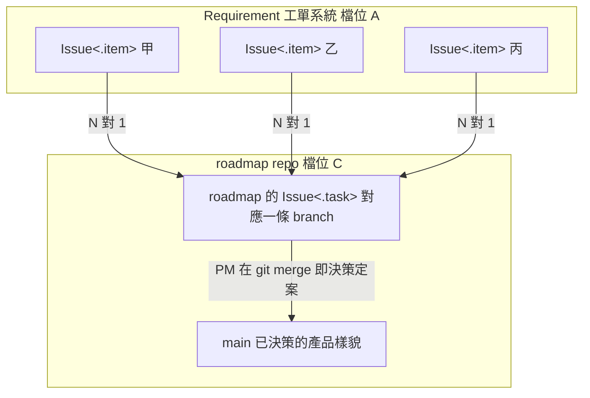
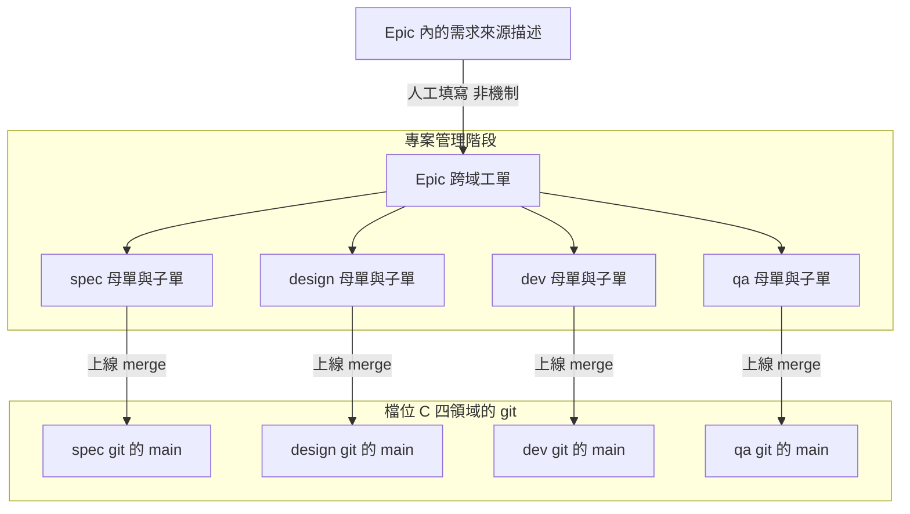
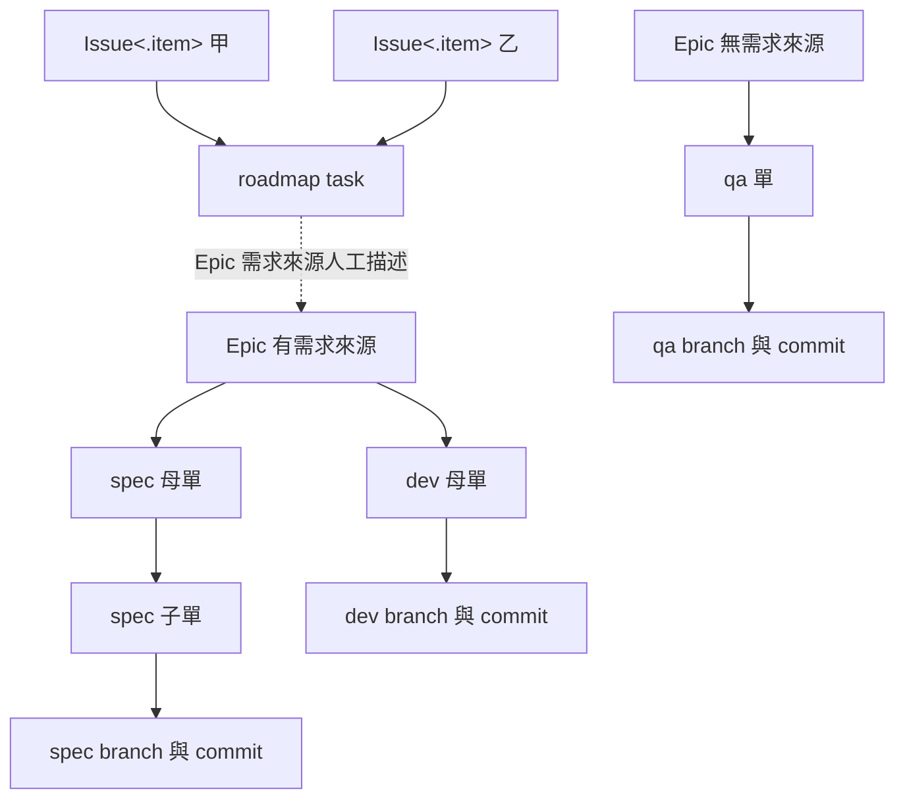

# 資料模型與追溯

> 本篇回答工單如何對應 branch、追溯鏈如何成形。建議先讀所有權檔位篇與組織與泛型結構篇。

## 通則

- 本篇描述單一 `Management<T>` 內部的運作
- 本質是把 Git 的心智模型移植到產品管理
- 每張 `Issue<.task>` 等於一條 branch，merge 等於回寫真相
- 檔位 A 無 branch 也無 merge，寫入即生效
- 檔位 C 的真相是 git 的 main，系統只持有 commit 指標
- 兩檔位的推導細節見所有權檔位篇
- 全鏈總覽圖畫的是單一 Team 的六個領域
  - Requirement 與 Roadmap 隨 Product 各開一套
  - 執行四域隨 Project 一套，多 Team 時整組各開

---

## 全鏈總覽圖

- 全鏈拆成兩張圖：需求到決策一張，執行到上線一張
- 需求到決策圖回答需求如何收斂成產品決策

- requirement 資料庫無 repo 掛勾，真相與異動塌成同一物件
- WishList 是需求列表，一列一張 `Issue<.item>`
- 單內含 title、description、自定義欄位
- 一張 roadmap task 可收多個 .item
- 一個 .item 只連一張 roadmap task，要多連就拆單
- roadmap task 的內容是修改 roadmap 文件
- merge 後系統持有新的 commit 指標
- 執行到上線圖回答決策如何落到檔位 C 四領域的 git

- Development List 收多個 Epic 拖放排 priority，排序越前越優先
- Epic 是跨域工單，不綁單一領域
- 需求來源有內容的 Epic 對應一個要上線的功能
- 需求來源留白的 Epic 是例行工作，如發版回歸
- 施工依據由 Epic 描述與 roadmap 內容人工對照
- 母單與子單同型，差別只在有無父單
- branch 是自定義欄位，團隊自訂填在母單還是子單
- dev git 依專案拆分，泛型寫法是 `Dev[Project]`
- 功能上線後，Epic 底下所有 Task 的 branch merge 進各 git 的 main
- 各 git 由負責人自行 merge，系統只顯示進度、不協調
- 四領域 git 的 main 是線上實際狀態，內容系統不解析
- 對照 roadmap main 是已決策的產品樣貌，兩者語意不同

---

## 各領域的 repo 與工件

- 真相本體在各領域掛勾 repo 的 main，系統只持有指向
- repo 掛勾由檔位決定
  - 檔位 A：不掛 repo，異動列本身即真相
  - 檔位 C：掛一個使用者 repo，工單以 commit 指標指向
- 範例共六條
  - WishList：需求收單池，單一 Wish 可以不處理
    - 檔位 A，實體是資料庫裡的需求列表，一列一張單
    - 單內含 title、description、自定義欄位
    - description 支援 markdown 與截圖
  - Roadmap：檔位 C，實體是使用者 roadmap repo 內的 roadmap 文件
    - 內容形式是使用者的文件約定，系統不解析、不持有
    - PM 在本機編輯，系統只持有 commit 指標
  - Spec：檔位 C，實體是使用者 repo 內的規格文件
    - 分幾層由使用者寫文件時自訂，系統不切分
    - 改動內容寫在工單的 description
  - Design：檔位 C，實體是 html、css、JS 做的 mockup code
    - 工件 git 原生可 diff、可 merge，不依賴 Figma 檔
    - repo 內怎麼分層是使用者的目錄約定，系統不持有
  - DevFE、DevBE 與 `Dev[Project]`：檔位 C，開發側真相
    - 拆分由團隊決定：by service、by code 專案、by 前後端
  - Quality：檔位 C，qa git 只放回歸測試流程文件
    - 高度整理過的流程，每次 production 更新改一版
    - 功能測試案例不進 git，寫在該 Epic 的 QA 單裡
    - 兩者不共用：功能測試的前提與步驟與回歸測試不同

---

## Issue 型別模型

- 工單回答正在改什麼
- 工單統一型別是 `Issue<T>`，種類由 `issue.type` 判別
- T 分三種：.item、.task、.epic
- 欄位收在四組欄位容器，名稱暫定
  - BasicFields、TaskFields、RelationFields、EpicFields
  - 每組內含預設欄位加自定義欄位
  - 自定義欄位可自訂名稱與 value 型別
- Field 是具體型別，非泛型
  - TextField、SelectField、NumberField、DateField、UserField、RefField
- `Issue<.task>` 可遞迴互掛，母子同構，深度不限
- Task 持有所屬 Epic 的關聯欄位，多對一記在多的那邊
- Epic 在 Project 層，跨四域，不屬任何單一 Management
  - 皆進 Development List 排 priority，因為都佔人力
- 排序是工單上的持久欄位，不是查詢時算出來的
- 掛載規則
  - Task 一定掛在 Epic 底下 → 禁止孤兒工單
  - 不同層級不可掛前後順序 → 依賴只存在同層 → 排程檢查可控
- 排程依賴與追溯關聯是兩種邊，不可混用
  - 追溯走 ref 型別欄位，排程走同層的前後順序邊

---

## 兩種真相的語意

- 本節只涉及帶 repo 掛勾的領域
- merge 時機是領域約定，不由檔位推導
- roadmap 在決策時 merge → main 是已決策的產品樣貌
- 其餘四域在上線時 merge → main 是線上實際狀態
- 效果：查 spec main 看到線上行為，查 roadmap main 看到決策方向
- 追溯出貨規格不看 roadmap main 當下狀態，看該 Epic 底下 spec task 的 commit
- 出貨當時的規格文件本體，由該 Epic 底下 Task 的 commit 承載

---

## Git 從隱喻升級為實作

- 概念定調：Git 不是類比，是系統的實作基礎
- 對照表對五個帶 git 的領域字面成立

| 模型概念 | git 對應 | 語意 |
|---|---|---|
| 真相 | 各域 git 的 main | 產品現在是什麼 |
| 工單 | 各域 git 的 branch | 正在改什麼 |
| 回寫 | merge | merge 過的內容即真相 |
| 版本與快照 | commit | diff 與歷史由 git 原生承載 |

- 設計含義：spec 像程式碼一樣被版本管理，字面為真
- 檔位 A 完全不適用，無 branch 也無 merge

---

## TraceMap 追溯鏈

- 血緣鏈：`Issue<.item>` → roadmap 的 `Issue<.task>` → roadmap 內容 → Epic 需求來源 → `Issue<.epic>` → 各域母子單 → branch 與 commit
- 強制段與紀律段分開明寫
  - .item 連 roadmap task 的關聯是機制強制
  - Epic 往下到 Task 與 commit 是機制強制
  - roadmap 到 Epic 靠 Epic 需求來源人工描述，是紀律非機制
- 血緣圖回答追溯鏈長什麼樣、無需求來源的 Epic 收在哪

- 無需求來源的 Epic，追溯鏈在此處收束，不往上接 roadmap task
  - 這是刻意的設計，不是斷鏈
  - 不屬於任何決策的工作有處可掛，孤兒工單維持禁止
- 往上走：這個 bug 違反哪條原始 spec
- 往下走：這條需求落到哪些改動
- 追溯精度統一為 commit 級
  - 檔位 A 例外，精度到資料列 id
  - 要看條目得自行打開該 commit，系統不解析內容
- TraceMap 不是附加功能，是整個模型的骨架

---

## 與 JIRA 單軌模型的差異

- JIRA 一切皆 issue → 只有工作資料庫 → 單子關閉後知識埋進封存
- spec 放 wiki → 與工單無結構鏈結 → 真相過期無人知
- IGotThis 拆成三問
  - 現在是什麼：repo 掛勾指向的 main 回答
  - 改了什麼：工單回答
  - 為何而改、由誰而改：TraceMap 回答
- 系統對帶 repo 的領域持有強制掛勾與 ref 欄位，內容本體留在 git
  - 對 roadmap 到 Epic 一段不設機制
- 一條需求從開單到上線的逐段旅程，見端到端流程篇
