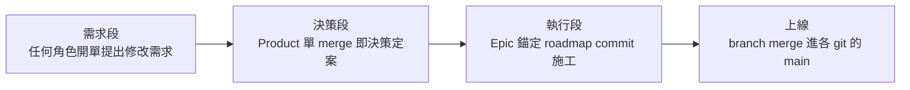
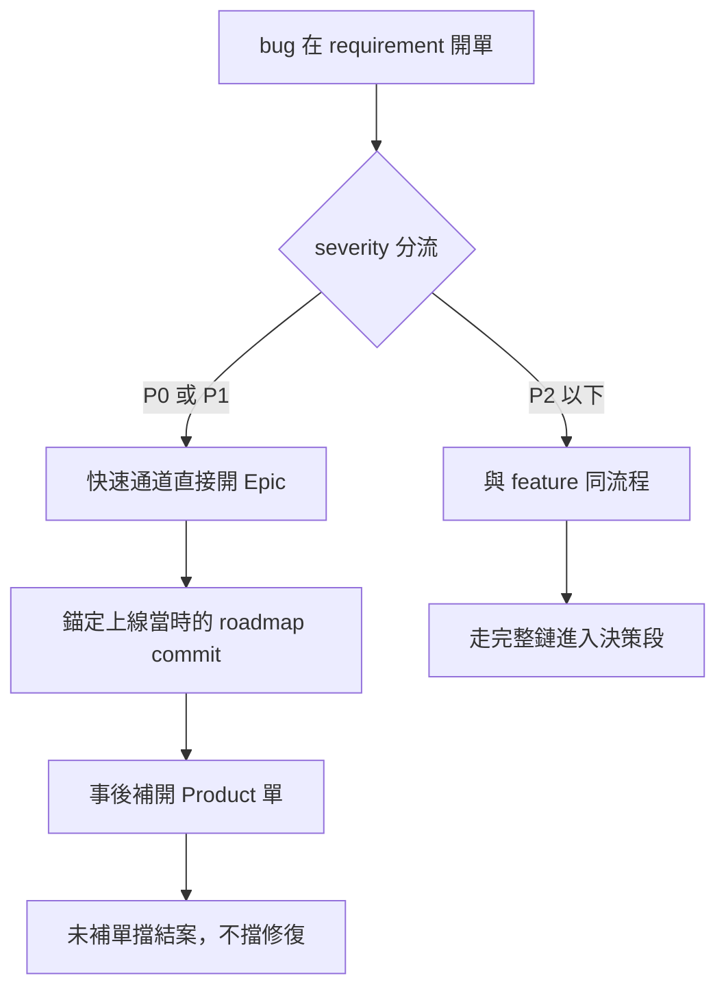

# 端到端流程

> 本篇回答一條需求從開單到上線的完整旅程，分需求、決策、執行三段，並收測試的兩種形態與反向流。建議先讀資料模型與追溯篇。整體架構見資料模型與追溯篇的全鏈總覽圖。

## 全流程圖

- 全流程圖回答：一條需求從開單到上線，依序經過哪些段

- 需求段收單與分流，決策段定案產品樣貌，執行段施工到上線
- 各段細節見需求段、決策段、執行段各節

---

## 需求段

- 任何角色在 requirement 開單，提出修改需求
- 單的實體：需求列表裡的一列，存在資料庫
- 單內含 title、description、自定義欄位
- description 可寫 markdown 與貼截圖
- bug 也在此階段開單，靠 requirement 的類型欄位區分 feature 與 bug
- bug 急修走 severity 分流：
  - P0 與 P1 走快速通道：直接開 Epic，錨定該功能上線當時的 roadmap commit，事後補 Product 單
  - P2 以下與 feature 同流程，走完整鏈
- 分流圖回答：一張 bug 單依 severity 走哪條路

- severity 判定：
  - 依固定判定表初判，開單者自行照表選級
  - 判定表以影響範圍分級，如全站不可用、主要功能失效、有替代路徑
  - PM 覆核，可改判
  - 覆核存在的理由：無覆核則急件浮報，快速通道變成繞流程的門
- 快速通道的補單：
  - 快速 Epic 未關聯補開的 Product 單即不可結案
  - 擋的是結案不是修復，急修速度不受影響
- PM 開 Product 單並在 roadmap repo 開 branch，關連對應的 requirement
- 基數規則：
  - 一張 Product 單可關連多個 requirement
  - 一個 requirement 只能關連一張 Product 單
  - 發現需要連到多張 → 拆 requirement

---

## 決策段

- 一張 Product 單對應 roadmap repo 的一條 branch
- branch 內容是修改 roadmap 文件，PM 在本機編輯
- PM 在 git merge 該 branch 即決策定案 → 進入專案管理階段
- 系統持有 merge 後的 commit 指標

---

## 執行段

- 專案管理階段涵蓋 spec、design、dev、qa，四者皆檔位 C
- 開 Epic：典型的 Epic 是一個要上線的功能
- Epic 錨定 roadmap commit，一個 Epic 可錨定多個 commit
- 無對應決策的工作開一個錨點為空的 Epic，如發版回歸、例行維護
- 施工依據錨定 commit 當下的 roadmap 內容
- roadmap main 後續前進時，PM 可換錨到新的 roadmap commit
- 換錨後施工範圍跟著新 commit 調整
- 錨點漂移系統不主動提示，由 PM 自行盯 roadmap 動態
  - 系統可比對錨定 commit 與 roadmap main，仍不主動提示，是介面選擇
- 多個 Epic 組成 Development List，管理 Epic 之間的 priority
- 各域開母單與子單，全部掛在 Epic 底下
- 母子單範例，Epic 為 promotion 新類型：
  - spec 母單：promotion 新類型
  - spec 子單：promotion setting 新類型、promotion 相關 report
  - design、dev、qa 有同構的母單與子單
- Task 與 branch 的對應靠自定義欄位承載
- 團隊自訂 branch 欄位填在母單還是子單
- 功能上線後，Epic 底下所有 Task 的 branch merge 進各 git 的 main
- 上線 merge 不由系統協調，各 git 由負責人自行 merge
- 系統只顯示 Epic 的 merge 進度，標出哪些 branch 還沒併
- QA Task 完成與否不擋上線，狀態只顯示，上線由人決定

---

## 測試的兩種形態

- 測試分功能測試與回歸測試兩形態，差異收在一張對照表

| 項目 | 功能測試 | 回歸測試 |
|---|---|---|
| 跟著什麼走 | 有錨點的 Epic | 版本，每次 production 更新跑一輪 |
| 案例規模 | 案例數少、一次性，測完即結束 | 案例數大 |
| 案例放哪 | 該 Epic 的 QA 單裡 | qa git 的流程文件，每次更新改一版 |
| 結果寫哪 | 同一張 QA 單的 markdown 表格 | 錨點為空 Epic 下的 QA 單，markdown 表格 |

- 功能測試單的 description 以 markdown 表格呈現步驟、預期、結果，可附截圖
- 功能測試測出問題就開 bug 單，關聯到該 QA 單
- 回歸測試執行時開一個錨點為空的 Epic，其下開 QA 單
- 回歸測試結果同樣以 markdown 表格寫在單裡
- 兩者的案例不共用
  - 回歸測試是高度整理過的流程
  - 功能測試的前提條件與步驟與之不同，不從回歸案例拉取
- 執行紀錄不做結構化
  - 系統不解析表格內容，不提供通過率與進度統計
  - 代價已知：回歸輪次的統計與跨輪歷史查詢皆無

---

## 反向流

- 決策推翻不走特殊流程，一律回需求段走新循環
- 推翻本身是新 requirement → 新 Product 單 revert 決策
- 已上線的功能要動，再開新 Epic 施工
- 反悔也是變更，同軌留痕，TraceMap 不留洞
