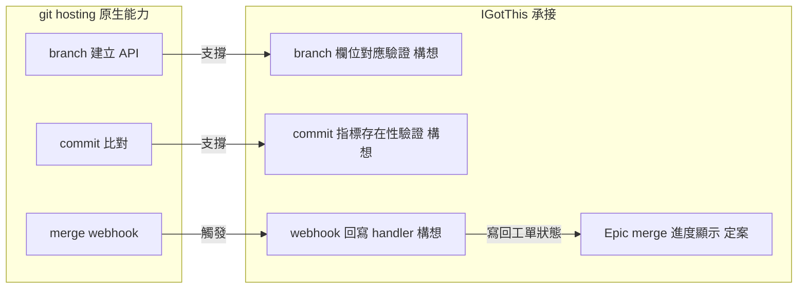

# 系統邊界與市場對照

> 本篇回答系統刻意不做什麼，以及與 git hosting 和市面工具的分工，並收真差異化與 build vs buy 判斷準則。建議先讀系統總覽篇。

## 產品不含 AI 成份

- 邊界細則：
  - 不保管模型金鑰
  - 不跑推論
  - 不建沙箱
  - 不接任何模型 API
  - 不為任何 AI 工具編譯設定檔，不做掛鉤分發
- 施工與讀取全在使用者本機，由使用者自理
- 系統唯一相關的欄位，是標記某張 Task 由外部工具產出
  - 該欄位只影響工時統計，不改變工單的其他行為
- 不含 AI 的理由：
  - 施工要能跑測試、build、讀錯誤再改一輪，雲端中介沒有可執行環境
  - 工具每季換代，自建串接是無完工日的追隨成本
  - 程式碼與金鑰過第三方雲端會撞客戶資安審查
  - 綁定特定工具會讓產品跟著該工具一起過期
- AI 協作的實際動線，見系統總覽篇的協作模式全景圖

---

## 與 git hosting 的分工

- hosting 原生就有：branch 建立 API、merge webhook、protected branch、commit 比對
- 系統要自建的部分分兩類
- 定案的顯示與匯出功能：
  - Epic 的 merge 進度顯示，標出未併的 branch
  - 關聯資料匯出，寫進 repo 供使用者自行取用，細節見功能構想篇
- 構想中的掛勾自動化，綁定深度與作法之後再議，尚非定案：
  - branch 欄位與 hosting 實際 branch 的對應驗證，命名本身不強制
  - commit 指標的存在性驗證，填錯當場提示但不擋結案
  - webhook 回寫 handler：merge 事件發生 → 反查工單 → 寫回工單狀態
- 分工圖回答：哪些能力 hosting 原生提供、哪些由系統承接

- 分工圖只列能力歸屬，標構想的掛勾作法皆未定案
- protected branch 屬 hosting 原生能力，無對應自建項，不入圖
- 關聯資料匯出不依賴掛勾，不入圖，細節見功能構想篇
- hosting 沒有跨 repo 原子 merge，系統不自建協調器、只做狀態呈現
  - 仲裁一律由 git 承擔
- 選型訊號：
  - GitLab 原生 Epic、依賴、group 權限繼承，對映度高，關鍵能力綁 Premium
  - GitHub 需以 Projects 與 sub-issues 拼裝，權限能力綁 Enterprise
  - 需要 on-prem 落地時 GitLab self-managed 較成熟，此前提會翻轉選型

---

## 市面成熟功能

- Gantt 與依賴重排：ClickUp、Monday、MS Project 皆現成
- 自定義表單：JIRA、Azure DevOps 皆可配置
- branch 與 commit 關聯工單：JIRA smart commit、Linear、Azure DevOps 原生支援
- 測試管理：TestRail、Xray、Azure Test Plans
- 假日與工時：Tempo 生態

---

## 真差異化

- TraceMap 的強制追溯成立兩段
  - 一段是 `Issue<.item>` 連 roadmap task
  - 一段是 Epic 往下到 task 與 commit
  - roadmap 到 Epic 一段不設機制，靠 Epic 內的需求來源描述
  - 一般 PM 工具靠人工紀律，合規級 ALM 工具昂貴且體驗差
  - 護城河是兩段機制強制加統一資料模型，非全鏈機制
- 部分成立：工單之外持有指向系統現況的強制指標
  - 市面工具只有工單，沒有指向系統現況的強制指標
  - 系統持有的是指標而非內容庫，與市面的差異因此縮小
  - 與 smart commit 的差別在強制性與兩種真相語意，不在資料量
  - 兩種真相語意的細節見資料模型與追溯篇
- 商品化說服力壓在單一條差異化上
  - 這是選擇薄層定位換來的，不是疏漏

---

## build vs buy 判斷準則

- 兩個以上現成工具已成熟的功能 → 用現成，自建無護城河
- 價值來自統一資料模型與 schema 強制 → 值得自建，但自建資料層與薄層工具
- 市場真空且與自身 workflow 綁定 → 值得自建且要快
  - 符合此格的只有跨六域的強制追溯圖
- 產品維持純薄層，無自建編輯器成本
