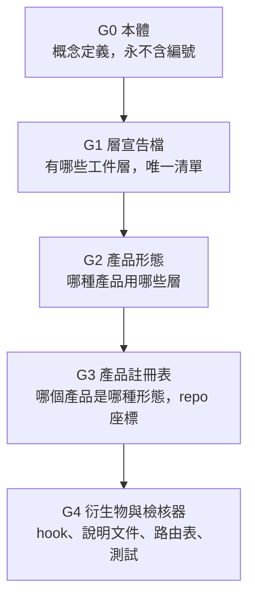

# 治理堆疊：五級單一真相

> 把產品管理文件系統拆成五級，每級只回答一類問題，下級變動不回頭改上級。

---

## 層的雙義：先拆字義

治理混亂的一大來源是層一詞雙義。設計時必須拆開命名：

- **決策階段 stage：** 提案、需求、整合、落地。思考流程的普世切分，屬產品管理方法論本身，不隨任何工作區的目錄結構變動。決策框架文件描述的是 stage
- **工件層 artifact layer：** spec、design、impl 這類承載產出物的容器。工作區的實作選擇，會隨組織需要增減與重排

判準：換目錄名、換編號後仍是同一個思考活動，就是 stage。本質綁定某個目錄或 git 邊界，就是 artifact layer。

stage 數量可寫死在方法論文件，數量屬理論本身。artifact layer 的數量與清單只活在層宣告檔，敘述文件寫死就是未爆彈。

既有命名的豁免：決策框架文件把四個 stage 稱為提案層、需求層、整合層、落地層。該處的層字屬 stage 義的既有命名，依本節判準讀，不視為 artifact layer。

### stage 產出的落點

stage 與 artifact layer 的對應是多對一，不是一對一：

- 提案 stage 的產出落在 initiation 層
- 需求、整合、落地三個 stage 的產出共同落在 planning 層
- 規格開發之後的產出落在 spec、design、impl 等下游層

layer id 刻意避開 stage 名稱。提案 stage 的容器取名 initiation 而非 proposal，避免同名混讀。

---

## G0 本體

定義概念本身，永不出現編號、目錄名、層數：

- **產品 product：** 一個獨立的價值單位，對應一個頂層 git
- **模組 module：** 產品內可獨立演化的子系統，模組粒度的工件層依模組拆分
- **工件層 artifact layer：** 承載某類產出物的容器，有明確的 git 邊界
- **git 邊界：** 工件層的三種容身形式——頂層 git 內的目錄、獨立 git、產品目錄外的工作區級目錄
- **配對 pairing：** 同一主題橫跨多個工件層時，各層變更以相同 branch 名與 commit 訊息綁定
- **決議流向：** 工件層對之間有預設的仲裁與跟隨方向。仲裁端承載定案、跟隨端對齊。模組可在檔案級細化或覆寫預設方向

本體放在知識庫，屬通用理論。工作區只引用、不重定義。

---

## G1 層宣告檔

唯一宣告現存工件層清單的機器可讀檔。層的身分、編號、目錄名、git 邊界只在這裡寫。欄位設計見層宣告規格文件。

宣告檔回答的問題：

- 有幾個工件層，各叫什麼
- 每層的目錄名與排序編號
- 每層的 git 邊界與拆分粒度
- 層與層之間的上下游連鎖

---

## G2 產品形態

不同產品用不同的層組合，例如後端服務無設計層、純概念產品未到實作層。形態宣告組合，產品引用形態。完整的形態清單與欄位設計只在產品形態文件承載，本節不列舉。

---

## G3 產品註冊表

實例級。每個產品一條：引用哪個形態、頂層 repo 座標、模組清單、模組級的細粒度決議規則。路徑不重複宣告，由層宣告檔的目錄名加模組 id 推導。

---

## G4 衍生物與檢核器

衍生物是所有讀取層模型的下游。代表例：自動攔截工具的目錄正則、各 repo 說明文件的結構敘述、路由 skill 的連鎖表、長期記憶的路徑引用。完整盤點與管理策略只在衍生與寫作規約文件承載。

檢核器是 G4 的特殊成員：讀 G1 到 G3，輸出 drift 報告與補建待辦兩類結果。宣告檔與衍生物的一致性由檢核器把關，契約見衍生與寫作規約文件。

---

## 知識庫與工作區的分工

- **知識庫承載 G0：** 通用本體與方法論，跨工作區成立
- **工作區承載 G1 到 G4：** 層宣告檔、形態、註冊表、衍生物綁定具體工作區的目錄與工具
- 新工作區採用此架構時，抄 G0 概念與 G1 到 G4 的骨架，填自己的層與產品

---

## 變更影響範圍速查

| 變更 | 動 | 檢核後同步 | 不動 |
| --- | --- | --- | --- |
| 重排層編號 | G1 呈現欄位 | G4 | G0、G2、G3 |
| 新增一個工件層 | G1 加條目、相關形態加引用 | G3 補登新 repo、G4 | G0 |
| 新增產品形態 | G2 加條目 | 無 | G0、G1、G3、G4 |
| 新產品上線 | G3 加條目 | G4 盤點範圍 | G0、G1、G2 |
| 重新定義何謂模組 | G0 | 全部下級重審 | 無 |
